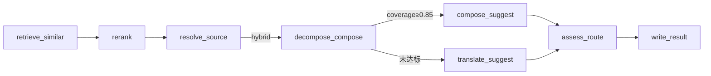

# PreTranslateGraph 实现进度快照

> 更新日期：**2026-07-18**  
> 关联路线图：[pretranslategraph_阶段二_886a27fa.plan.md](./pretranslategraph_阶段二_886a27fa.plan.md)  
> Story：`US-3E-01`（切分轨迹落盘）；`US-3D-01` / `US-3C-01` / `US-3C-02` 已关闭

---

## 总览进度条

```
阶段一 API 去冗余     ████████████ 100%  已完成
Phase 1  图合并       ████████████ 100%  已完成
Phase 2  term_word    ████████████ 100%  已完成
Phase 3a Grep∥RAG     ████████████ 100%  已完成
Phase 3b 拆解 MVP     ████████████ 100%  已完成
Phase 3c 代码实现     ████████████ 100%  已完成
Phase 3c UI 验收      ████████████ 100%  已完成（US-3C-01）
Phase 3d n-gram 对齐  ████████████ 100%  已完成（US-3D-01）
切分轨迹双端落盘      ████████████ 100%  已完成（US-3E-01）
Comment 规则→拼装    ████████████ 100%  已合入（旁路增强，非 Phase 4）
Phase 4  矛盾治理     ░░░░░░░░░░░░   0%  需 lexicon skill
Phase 5  Judge/Darwin ░░░░░░░░░░░░   0%  可与 4 后并行
Phase 6  FAISS 混合   ░░░░░░░░░░░░   0%  可选
```

**当前位置**：主线仍停在 Phase 3 收尾（3E 切分轨迹已落盘）。2026-07-18 旁路增强：`comment_rule` 全栈 + `compose_suggest` 按 comment 优先缩写。默认下一步：等 lexicon skill 后 Phase 4。

---

## 已实现能力（按 Phase）

### Phase 1 — PreTranslateGraph 单一流水线 ✅

| 能力 | 关键文件 |
|------|----------|
| StateGraph 编排 | `terminology-agent/app/graph/pre_translate/builder.py` |
| exact / fuzzy / none 检索路由 | `edges/after_resolve_source.py` |
| 无 `[Agent]` 占位译文 | `nodes/features/llm/translate_suggest.py` |
| BatchOrchestrator 编排层 | `app/orchestration/` |

### Phase 2 — term_word 元词索引 ✅

| 能力 | 关键文件 |
|------|----------|
| term_word 表 + WordRepository | `app/repository/word_repo.py` |
| 离线 ETL | `scripts/build_word_index.py` |
| Trie（非切界主路径，保留调试） | `app/shared/term_word/trie.py` |

### Phase 3a — Grep ∥ RAG 并行检索 ✅

| 能力 | 关键文件 |
|------|----------|
| 双路并行 + merge | `nodes/features/io/retrieve_similar.py` |
| retrieval_source 标记 | `domain/translation_source.py` |

### Phase 3b — 拆解 + coverage 门控 ✅

| 能力 | 关键文件 |
|------|----------|
| decompose_compose 子图 | `nodes/features/workflow/decompose_compose.py` |
| lookup_lexemes | `nodes/features/io/lookup_lexemes.py` |
| coverage 阈值 0.85 | `constants.py` → `COVERAGE_FLOOR` |
| hybrid 条件边 | `edges/after_decompose_compose.py` |
| ADM 测试基建 | `devtools/fix_adm_test_data.py` |

### Phase 3b UX — 审核意见拷贝 ✅

| 能力 | 关键文件 |
|------|----------|
| auto_approved → englishAuditSuggest | `translation/src/utils/agentPreTranslateBackfill.js` |
| 术语学习 Agent 说明列 | `translation/src/views/terminologyAgent/index.vue` |

### Phase 3c — jieba 切界 + LLM 受约束拼装 ✅（本次主交付）

| 子项 | 状态 | 关键文件 / 说明 |
|------|------|-----------------|
| 3c-0 jieba 通用分词 | ✅ | `app/shared/term_word/segment.py` |
| Grep/decompose 共用切界 | ✅ | `utils/decompose.py`、`utils/grep_retrieve.py` |
| 3c-1 decompose 不写 suggested | ✅ | `decompose_compose.py` 只写 spans/coverage/decomposed |
| 3c-2 compose_suggest 节点 | ✅ | `nodes/features/llm/compose_suggest.py`、`prompts/compose_suggest.py` |
| 3c-3 术语校验 + fallback | ✅ | `utils/compose_validate.py`、`LLM_COMPOSE_*` 常量 |
| 3c-4 单测 + 文档 | ✅ | 72 项 pre_translate 测试；`trajectory_cases.json` |

**黄金用例实测**（2026-07-13，本地 MySQL + LLM）：

| 源词条 | decomposed (trace) | suggested (LLM) | retrieval | review |
|--------|-------------------|-----------------|-----------|--------|
| 文件与系统 | File+System 拼接 | **File and System** | decomposed | auto_approved (0.88) |
| 文件、系统、资源 | 词片 trace | LLM 自然短语 | decomposed | auto_approved (0.88) |

### 伴随交付（非路线图主 Phase，但已合入）

| 能力 | 关键文件 |
|------|----------|
| audit 写入去重指纹 | `app/shared/audit_fingerprint.py` |
| entry_comment 消歧键 | `scripts/migrations/001_add_entry_comment_to_term_agent_audit.sql` |
| 审核意见列统一识别 | `translation/src/utils/auditSuggestColumn.js` |
| SpanByTips 审核意见填充 | `translation/src/components/SpanByTips/` |
| **Comment 规则 CRUD + Excel 导入**（2026-07-18） | `app/api/comment_rule.py`、`app/shared/comment_rule/`、`scripts/migrations/007_*.sql` / `008_*.sql` |
| **compose_suggest 读 comment_rule / prefer_abbr**（2026-07-18） | `nodes/features/llm/compose_suggest.py`、`prompts/compose_suggest.py` |
| 术语库 glossary：Comment 规则 Tab | `translation/src/views/glossary/CommentRules.vue` |
| term_word 字典页 / 拆分导出 / 正则筛选（平行交付） | `TermWordDictionary.vue`、`SplitExportModal.vue`、`word.py` 高级筛选 |

> 说明：Comment 规则是对 Phase 3c 拼装的**场景约束旁路**，不替代 Phase 4「矛盾治理 / lexicon curation」。

---

## 待实现 / 待验收

### P0 — Phase 3c UI 全矩阵验收 ✅（2026-07-16）

| # | 场景 | 后端/API | UI |
|---|------|----------|-----|
| 1–4 | exact / fuzzy·none / decomposed / none+LLM | ✅ | ✅（API 矩阵 + 登录工作台） |
| 5 | 审核意见拷贝 reasoning | ✅ | ✅（vitest + Agent 说明列） |
| 6 | 术语学习 list / review | ✅ | ✅（list 页；review API） |

复验命令：`pytest -q` · `verify_adm_pretranslate --strict` · `verify_us3c01_api_matrix`

### P1 — Phase 3d（可选）✅（2026-07-16）

| 能力 | 关键文件 |
|------|----------|
| `align_spans_with_lexicon` 贪心 n-gram | `utils/align_spans.py`（`ALIGN_MAX_NGRAM=3`） |
| lookup / Grep 共用 | `lookup_lexemes.py`、`grep_retrieve.py` |
| jieba_parts + trace | `Span.jieba_parts`；`ngram_aligned` |

### P2 — Phase 4 矛盾治理 ❌（阻塞：需 lexicon skill）

- `LexiconCurationIntent` + 矛盾列表/裁定 API
- 前端 `lexiconGovernance` 模块
- 用户 skill → `references/lexicon-curation-rules.md`

### P3 — Phase 5 Judge + Darwin ❌

- `judge_translation` 节点
- `unsatisfied_reason` 回流 + eval 轨迹

### P4 — Phase 6 FAISS 混合检索 ❌（可选）

- 向量 + keyword 并行 merge

---

## 验证记录（2026-07-16 · Phase 3d）

| 检查项 | 结果 |
|--------|------|
| `pytest -q`（terminology-agent） | **151 passed** |
| `verify_adm_pretranslate --strict` | **6/6 OK** |
| Story | `US-3D-01` → implemented |

## 验证记录（2026-07-13 · Phase 3c）

| 检查项 | 结果 |
|--------|------|
| `pytest -q`（terminology-agent） | **142 passed** |
| pre_translate 专项测试 | **72 passed** |
| translation 前端单测（audit/SpanByTips） | **22 passed** |
| `verify_adm_pretranslate` | **6/6 OK** |
| API 冒烟 `文件与系统` → 英文 | decomposed + auto_approved + File and System |
| openCLI UI 登录 | 页面可开，自动登录未完全跳转（建议手工） |

---

## Git 提交批次（2026-07-13）

| # | Commit | 说明 |
|---|--------|------|
| 1 | `feat(agent): Phase 3c jieba 切界与 LLM 受约束拼装` | 核心算法 + 图编排 |
| 2 | `feat(agent): audit 去重指纹与 entry_comment 消歧键` | 数据层 + 去重 |
| 3 | `feat(ui): 审核意见列识别与 Agent 说明展示增强` | 前端 UX |
| 4 | `chore(devtools): ADM 测试矩阵适配 jieba 与自然中文复合句` | 测试脚本 |
| 5 | `docs(plan): 更新路线图 todo 并新增进度快照文档` | 本文档 + plan.md |

## Git 提交批次（2026-07-18 · Comment 规则旁路 + 术语库平行交付）

| # | Commit（摘要） | 说明 |
|---|--------|------|
| — | `docs(ops): 本地库精简检查点与 cleanup SQL` | 运维约定；备份目录见 `db/backups/` |
| — | `feat: 术语库与字典支持正则及高级筛选` | SYK/term_word 筛选（平行） |
| — | `feat(ui): 拆分导出预览行内编辑` 等 | glossary UX（平行） |
| — | `feat: Comment 规则全栈并接入预翻译拼装` | **与主图相关**：comment_rule → compose_suggest |

检查点备份（提交前）：`translationtool_20260718_190243_before_batch_commit_docker2.sql`（VERIFY OK；`.sql` 不入库）。

---

## 架构速览（Phase 3c 主路径）



切界 SSOT：`segment_source_text()`（jieba 默认词典，不 load_userdict）。  
术语库职责：**lookup 译法**，不主导猜词界。
