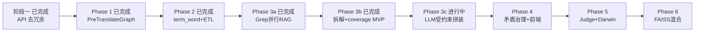
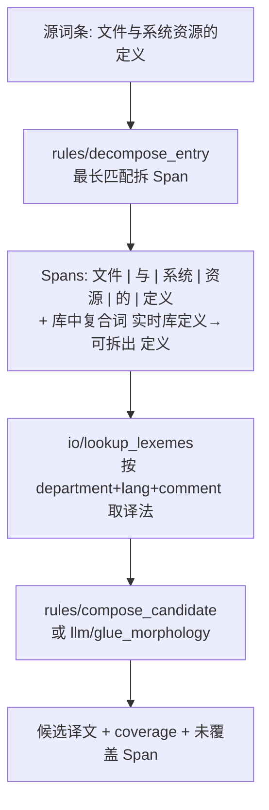
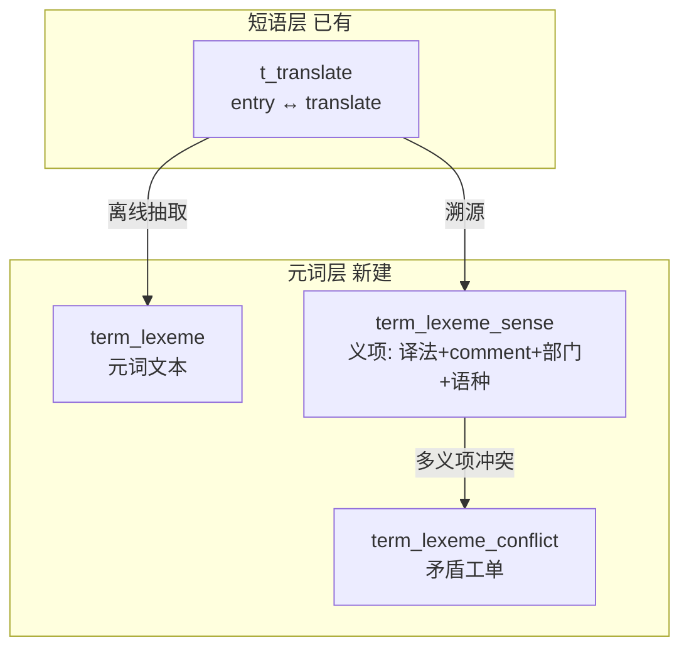
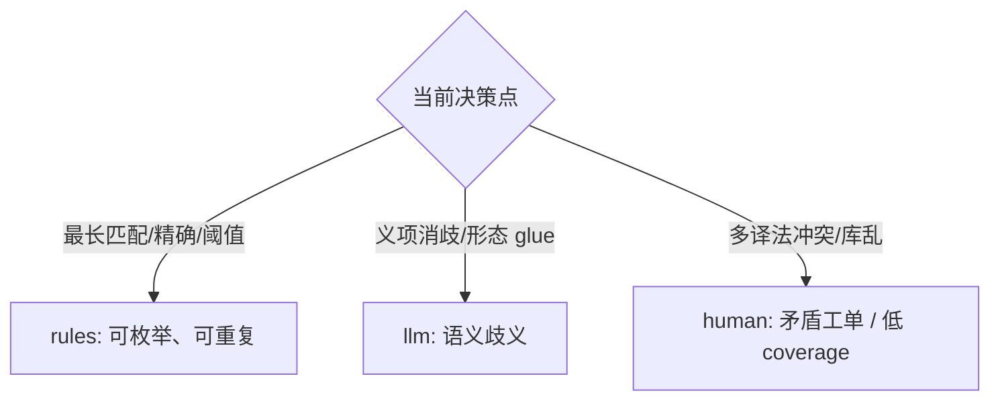
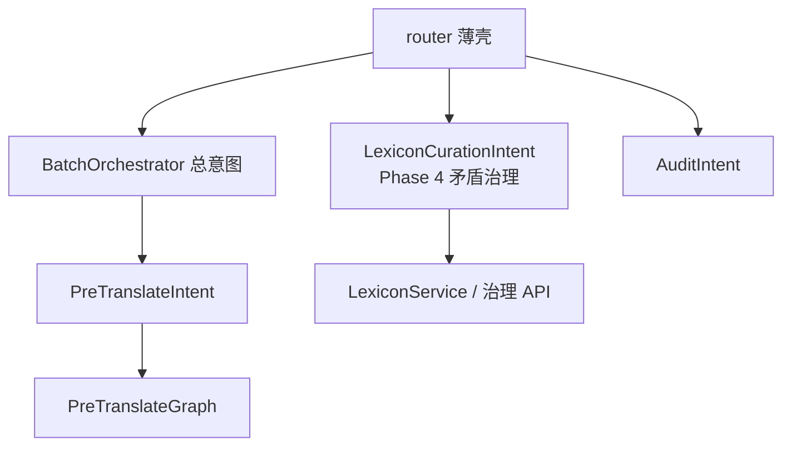
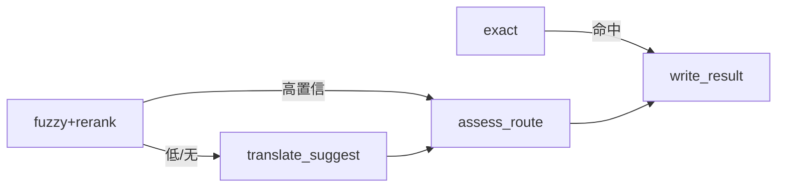
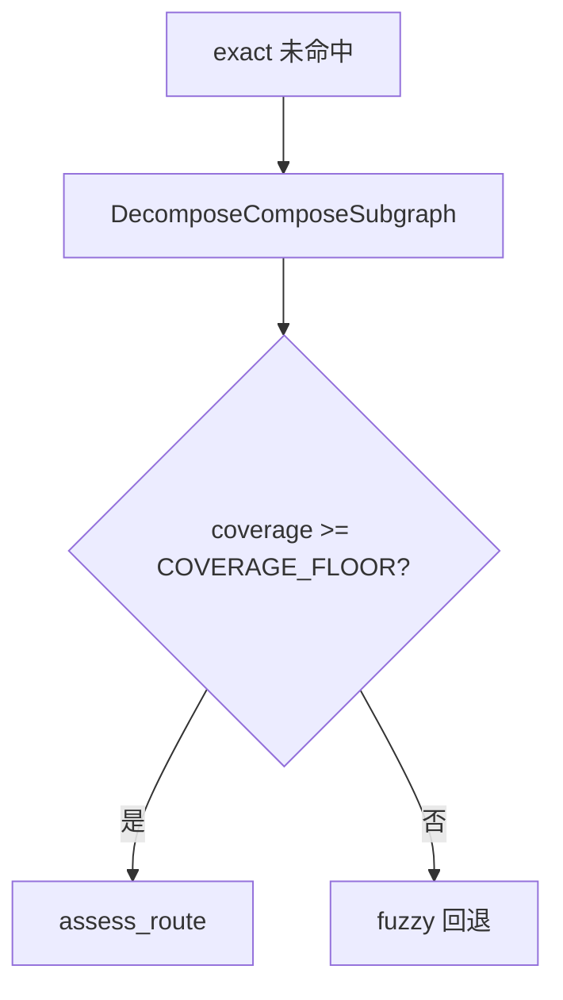
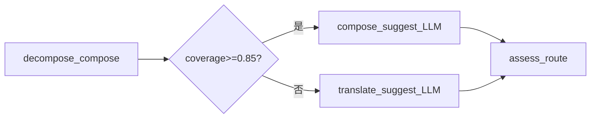
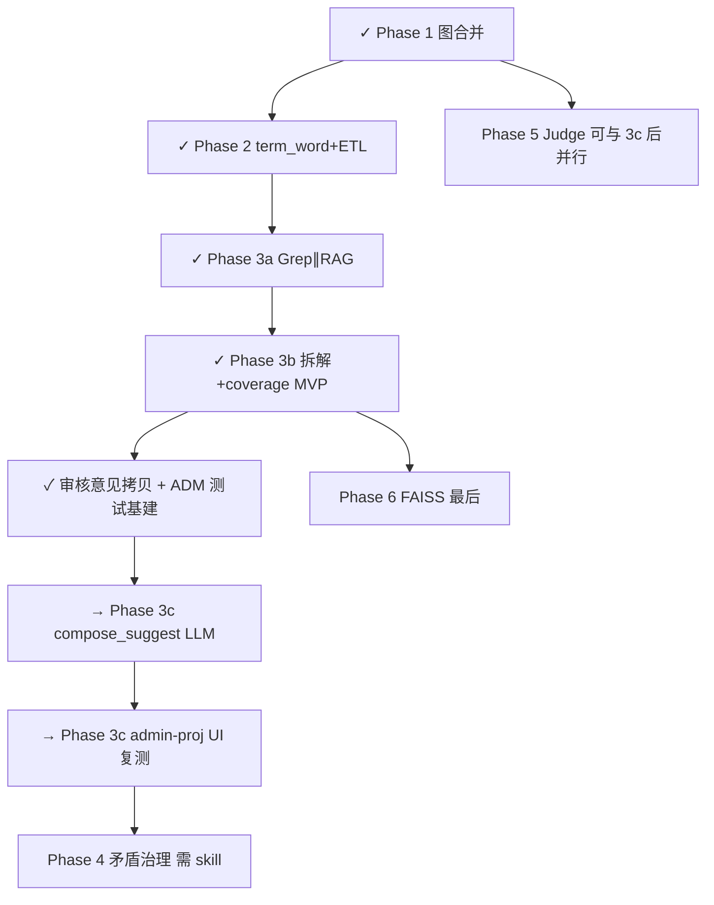

# i18n 术语 Agent — 分阶段路线图（v4）

> **前置已完成**：[阶段一](旧版_api_去冗余) 删除 `/run`、收紧 batch body、清理 dead code。  
> **本文档**：术语拆解复用 + 元词词典 + PreTranslateGraph + 矛盾治理 + Eval，按 **6 个 Phase** 渐进交付（Phase 3 拆为 3a/3b/3c）。

---

## 当前进度快照（2026-06-29）

| 里程碑 | 状态 | 说明 |
|--------|------|------|
| Phase 1 图合并 | **已完成** | [`PreTranslateGraph`](terminology-agent/app/graph/pre_translate/builder.py)、exact/fuzzy/none、无 `[Agent]` 占位 |
| Phase 2 元词库 | **已完成** | 实现为 `term_word` + [`build_word_index`](terminology-agent/scripts/build_word_index.py)（非文档原 `term_lexeme` 命名） |
| Phase 3a Grep∥RAG | **已完成** | [`retrieve_similar`](terminology-agent/app/graph/pre_translate/nodes/features/io/retrieve_similar.py) 并行 + merge |
| Phase 3b MVP 拆解拼装 | **已完成** | decompose + lookup + 确定性 `"".join()` + coverage 门控；**英文拼接质量不足** |
| 3b 手动测试基建 | **已完成** | ADM 种子/触发、ETL、[`fix_adm_test_data`](terminology-agent/devtools/fix_adm_test_data.py)、审核意见拷贝 |
| **Phase 3c P3b+** | **待做（下一步）** | LLM 受约束拼装 `compose_suggest`，解决空格/介词/语法 |
| Phase 4–6 | 未开始 | 矛盾治理 UI、Judge、FAISS |

**你现在在这里**：Phase 3b MVP 已跑通，正在进入 **Phase 3c**。

**建议下一步**：执行 **Phase 3c（P3b+ LLM 受约束拼装）**，完成后再做 **admin-proj 全矩阵 UI 复测**。

---

## 能力演进总览



| Phase | 用户可感知价值 | 依赖 | 状态 |
|-------|----------------|------|------|
| 1 | 单一流水线、无占位译文 | 阶段一 | 已完成 |
| 2 | 术语元词索引（Grep 语料） | 1 | 已完成 |
| 3a | RAG + Grep 双路检索、rag+grep 标记 | 2 | 已完成 |
| 3b | 长词条拆解、coverage 门控、decomposed 路径 | 3a | 已完成（MVP） |
| **3c** | **英文等语种自然词组（空格/介词）** | 3b | **下一步** |
| 4 | 元词矛盾可视、可人工裁定 | 2 + skill | 未开始 |
| 5 | LLM 评判 + 不满意归因回流 | 1 | 未开始 |
| 6 | 语义相似检索 | 2、3 | 未开始 |

---

## 核心产品目标：从「整句完全相同」到「拆解复用」

### 旧能力（Java + 当前 Agent MVP）

仅当 `t_translate.entry == 新词条` **全文一致** 时复用译文。

### 新能力（Phase 3 起）

对新词条 **最长匹配拆解** 为库中已有术语片段，再 **拼装** 目标语译文。

**示例**：`文件与系统资源的定义`



| Span | 库中命中 | 俄文示例（示意） |
|------|----------|------------------|
| 文件 | 术语「文件」 | файл |
| 系统 | 术语「系统」 | система |
| 资源 | 术语「资源」 | ресурс |
| 定义 | 来自「实时库定义」等复合词条的元词义项 | определение |
| 与 / 的 | 连接词（规则表或 LLM 形态 glue） | 语法连接 |

**coverage** 指标：`已覆盖字符数 / 源词条长度`；低于阈值不走 auto，进人工或 LLM 补全。

---

## 元词词典（Term Lexicon）— Phase 2 数据设计

术语库 `t_translate` 是 **短语级词典**（一条 entry 一个完整词条）。元词层在其上再建 **「可复用最小语义单位」** 索引。

### 概念分层



### 建议表结构（MySQL，Agent 侧新表）

**`term_lexeme`** — 元词主表

| 字段 | 说明 |
|------|------|
| `id` | PK |
| `lexeme_text` | 元词，如 `文件`、`定义`；**不再往下拆**（避免丢词义） |
| `lexeme_type` | `term` / `glue`（与、的）/ `compound_fragment` |
| `created_at` | |

**`term_lexeme_sense`** — 义项（同词不同 comment/部门/语种可多行）

| 字段 | 说明 |
|------|------|
| `id` | PK |
| `lexeme_id` | FK |
| `source_translate_id` | 来源 `t_translate.id`（溯源） |
| `target_lang` | 俄文/英文… |
| `department` | `visual_range`，可空=全局 |
| `comment` | 与源词条 `remark` / 释义 comment **绑定**，消歧 |
| `translate` | 该义项下译法 |
| `status` | `approved` / `pending` / `deprecated` |

**`term_lexeme_conflict`** — 矛盾工单

| 字段 | 说明 |
|------|------|
| `id` | PK |
| `lexeme_id` | |
| `target_lang`, `department` | 矛盾作用域 |
| `sense_ids` | JSON 冲突义项 id 列表 |
| `conflict_type` | `translate_mismatch` / `comment_ambiguous` / `department_overlap` |
| `resolution` | `open` / `human_resolved` / `llm_suggested` |
| `resolved_by`, `resolved_at` | |

**设计要点（用户要求）**：
- 同一 `lexeme_text` + 不同 `comment` → **多行 sense**，不强行合并
- 现有库「很乱」→ Phase 2 建库时 **全量标 `pending`**，仅 `translate_state=3` 且人工确认过的升 `approved`
- 矛盾不阻塞读：Agent 用 `approved` 义项；遇多义项未消解 → `needs_human` + 矛盾 id

### 离线建库 Job（Phase 2）

1. 扫描 `t_translate`（`delete_state=0`, `translate_state=3`）
2. **最长短语优先** 从每条 `entry` 抽取候选元词（与拆解算法共用 Trie）
3. 写入 `term_lexeme` + `term_lexeme_sense`（带 `source_translate_id`、`comment`←`remark`）
4. 同 scope 下 `translate` 不一致 → 写 `term_lexeme_conflict`

Java 侧已有 HanLP 分词工具类 [`TermProcessUtils.java`](translationtoolservice/src/main/java/com/shr/translationtoolservice/util/TermProcessUtils.java)，Phase 2 可 **Python 侧自研 Trie 最长匹配**（与库内短语对齐），HanLP 仅作未匹配 Span 的辅助建议。

---

## 判断分层：rules / LLM / human（全链路纪律）

对齐 nodes/README + 灵感池 **A/F** + 用户 skill（Phase 4 细化）：



| 决策点 | rules | LLM | human |
|--------|-------|-----|-------|
| 拆解 Span | 最长匹配 Trie | 未匹配片段建议切分 | 新复合词入库裁定 |
| 义项选择 | 唯一 approved sense | comment 语境消歧 | conflict 工单 |
| 全文 exact/fuzzy | 保留 Phase 1 路径 | — | — |
| 拼装 glue | 连接词映射表 | **Phase 3c：LLM 受约束拼装（词片作术语约束）** | conflict 工单 |
| 置信路由 | threshold | Judge | 终局 review |
| 元词矛盾 | 检测规则 | 合并建议（可选） | **Phase 4 前端** |

**待用户提供 skill**：Phase 4 将 skill 沉淀为 `references/lexicon-curation-rules.md` + `rules/` 节点单测用例。

---

## 意图层 == 编排层（延续 v2，扩展方向意图）



- **PreTranslateIntent**：单条预翻译，dispatch 图
- **LexiconCurationIntent**（Phase 4 新增）：矛盾列表、裁定、合并义项；**不与** batch 链式调用
- **AuditIntent**：终局审核入库（已有）

---

## PreTranslateGraph 检索漏斗（Phase 1 基线 → Phase 3 增强）

### Phase 1 路径（先交付）



无 `[Agent]` 占位；`retrieval_method`: `exact` | `fuzzy` | `none`。

### Phase 3 增强路径（接入拆解）

在 `exact` 未命中后、走 fuzzy 之前插入 **DecomposeCompose 子图**：



子图内部：`decompose_entry` → `lookup_lexemes` → `compose_candidate` →（可选）`llm/disambiguate_sense`

灵感来源：附录 **H**（词典分词、子图封装、Map-Reduce 查义项）。

---

## 人机「4→2」与不满意处置（不变）

- Agent：**RetrieveRank（含拆解）** + **TranslateJudgeRoute**
- 人：只审终局；L1 调参 → L2 改正 → L3 Darwin 归因

Phase 4 新增：元词矛盾页面 = **库治理** 的人工环，与单条预翻译终局审核分离。

---

## Phase 分阶段实施清单

### Phase 1 — 图合并 + 编排分层（2–3 天量级）

**目标**：单一流水线，删除 `TermLearningGraph`，无 `[Agent]` 占位。

**不依赖**元词库；为 Phase 3 预留 `retrieval_method: decomposed` 枚举位。

> 下文 **「Phase 1 实现详案」** 含目录结构、TDD 顺序、手工测试步骤；确认后说「执行 Phase 1」开始编码。

---

## Phase 1 实现详案

### 0. 命名对照（避免混淆）

| 名称 | 含义 | 状态 |
|------|------|------|
| **阶段一（API 清理）** | 删 `/run`、batch body 收紧 | **已完成** |
| **Phase 1（本详案）** | PreTranslateGraph + orchestration | **待做** |

### 1. 交付标准（Definition of Done）

- [ ] `POST /agent/pre-translate/batch` 行为与现网契约一致（`agent_meta` 六字段、`auto_count`/`pending_count`）
- [ ] 无命中时 **`retrieval_method=none`**，**禁止** `[Agent] xxx` 与 `hybrid`
- [ ] 无 LLM Key：无命中 → `needs_human`，`suggested_translation` 可为 `null`，`reasoning`/`error` 说明原因
- [ ] 有 LLM Key：无命中 → 走 `translate_suggest`（Phase 5 再加 Judge）
- [ ] `TermLearningGraph` 及 `discover`/`update_termstore`/`find_by_chinese` 已删除
- [ ] `pytest -v` 全绿（无需 MySQL / LLM Key）
- [ ] 手工：OpenAPI + 工作台 PreTranslateModal 至少跑通 exact / fuzzy / no-match 三场景

### 2. 目标目录结构

```
terminology-agent/app/
├── orchestration/
│   ├── __init__.py
│   ├── batch_orchestrator.py      # 总意图：过滤、循环、计数
│   └── intentions/
│       ├── __init__.py
│       └── pre_translate.py       # 方向意图：单条 → graph.run → agent_meta
├── graph/
│   ├── pre_translate_graph.py     # 新：替代 graph.py TermLearningGraph
│   ├── state.py                   # PreTranslateState（重命名/扩展 TermState）
│   ├── routes.py                  # route_after_retrieve（删 route_after_discover）
│   ├── retrieval_helpers.py       # _strip_placeholders / _similarity（从 service 迁出）
│   └── nodes/
│       ├── io/retrieve_similar.py
│       ├── rules/rerank_candidates.py
│       ├── llm/translate_suggest.py   # 复用 suggest 逻辑，仅 none 路径
│       ├── workflow/assess_route.py
│       └── io/write_result.py
├── services/
│   └── pre_translate_service.py   # 薄门面 → BatchOrchestrator（或 router 直调 orchestrator）
└── **/tests/                      # 见 TDD 节
```

**删除**（Phase 1 末）：

- [`graph/graph.py`](terminology-agent/app/graph/graph.py)（`TermLearningGraph`）
- [`nodes/io/discover.py`](terminology-agent/app/graph/nodes/io/discover.py)
- [`nodes/io/update_termstore.py`](terminology-agent/app/graph/nodes/io/update_termstore.py)
- [`nodes/workflow/review.py`](terminology-agent/app/graph/nodes/workflow/review.py)（旧 Graph 用）
- `term_repo.find_by_chinese`
- [`graph/tests/test_term_learning_graph.py`](terminology-agent/app/graph/tests/test_term_learning_graph.py)

**保留**（Phase 5 复用）：`llm/suggest.py`、`prompts/suggest.py`、`rules/analyze_context.py`（暂不接入 P1 主图）。

### 3. 图与路由（实现要点）


**`route_after_retrieve`**（只读 state，写在 [`routes.py`](terminology-agent/app/graph/routes.py)）：

| 条件 | 下一节点 |
|------|----------|
| `retrieval_method == "exact"` | `write_result`（跳过 assess 亦可，state 内 conf=1.0） |
| `retrieval_method == "fuzzy"` 且 `retrieval_confidence >= FUZZY_AUTO_FLOOR`（0.95） | `assess_route` |
| 否则 | `translate_suggest` → `assess_route` |

**`assess_route`**：`final_confidence >= confidence_threshold` → `review_status=auto_approved`，否则 `needs_human`。

**`write_result`**：

- `auto_approved`：不写 audit（与现逻辑一致）
- `needs_human`：调 `create_pretranslate_audit`（字段与现 [`pre_translate_service.py`](terminology-agent/app/services/pre_translate_service.py) L119–134 对齐）

**`translate_suggest`（无命中路径）**：

- 有 `LLM_API_KEY`：调用现有 suggest 节点逻辑，`target_lang` 从 state 传入 prompt（P1 可先最小改 prompt）
- 无 Key：`suggested_translation=None`，`confidence=0`，`error="LLM not configured"`，仍 `needs_human`

### 4. 编排层调用链

```python
# router.py
result = await BatchOrchestrator(session).run_batch(...)

# batch_orchestrator.py
for entry in entries:
    if entry.get("parentID") or not entry.get("entry"):
        continue
    item = await PreTranslateIntent(session).run_one(entry, batch_meta...)
    # 汇总 auto_count / pending_count / list

# pre_translate.py
final_state = await PreTranslateGraph().run(...)
return map_state_to_agent_meta(final_state, entry)
```

`map_state_to_agent_meta` 集中维护六字段映射，避免 router/service 重复。

### 5. TDD 开发顺序（红 → 绿 → 重构）

原则：**先写失败测试，再写最小实现**；每层 mock 下一层，不连 MySQL。

#### 5.1 迁移纯函数（已有绿测试）

| 步骤 | 动作 | 测试 |
|------|------|------|
| 1 | 将 `_strip_placeholders`、`_similarity` 迁到 `graph/retrieval_helpers.py` | 现有 [`test_helpers.py`](terminology-agent/app/services/tests/test_helpers.py) 改 import 路径，**保持绿** |
| 2 | `service` / 节点均从 helpers import | — |

#### 5.2 路由层 `@pytest.mark.graph`

新建 [`graph/tests/test_pre_translate_routes.py`](terminology-agent/app/graph/tests/test_pre_translate_routes.py)：

| 用例（先 RED） | 输入 state | 期望 |
|----------------|------------|------|
| `test_route_exact_to_write` | `retrieval_method=exact` | `"write_result"` |
| `test_route_fuzzy_high_to_assess` | `fuzzy`, conf=0.96 | `"assess_route"` |
| `test_route_fuzzy_low_to_suggest` | `fuzzy`, conf=0.7 | `"translate_suggest"` |
| `test_route_none_to_suggest` | `none`, conf=0 | `"translate_suggest"` |

实现 `route_after_retrieve` 后变绿。

#### 5.3 节点单测（mock Repo / LLM）

新建 [`graph/tests/test_retrieve_similar_node.py`](terminology-agent/app/graph/tests/test_retrieve_similar_node.py) 等：

| 用例 | Mock | 断言 |
|------|------|------|
| exact 命中 | `find_exact` 返回行 | `confidence=1.0`, `method=exact` |
| fuzzy 命中 | `find_exact=None`, fuzzy 列表 | `method=fuzzy`, `similar_terms` 非空 |
| 无命中 | 两者空 | `method=none`, `confidence=0`, **无** `[Agent]` 前缀 |
| rerank 排序 | 两个 fuzzy 候选 | 最高分候选成为 `suggested_translation` |

`translate_suggest`：mock `ChatOpenAI`（参考现有 [`test_llm_suggest_settings.py`](terminology-agent/app/graph/tests/test_llm_suggest_settings.py)）。

`assess_route`：threshold=0.8，conf 0.9 → auto；0.5 → needs_human。

`write_result`：auto 不调 `create_pretranslate_audit`；needs_human 调一次。

#### 5.4 图集成测

新建 [`graph/tests/test_pre_translate_graph.py`](terminology-agent/app/graph/tests/test_pre_translate_graph.py)：

- mock 整个 `TermRepository` 注入 config
- 跑 `PreTranslateGraph().run(...)` 断言 `final_state.review_status` 与 `trace` 至少 2 步（Retrieve + Assess/Write）

#### 5.5 编排层 `@pytest.mark.service`

迁移/新建 [`orchestration/tests/test_batch_orchestrator.py`](terminology-agent/app/orchestration/tests/test_batch_orchestrator.py)：

| 用例 | 说明 |
|------|------|
| `test_skips_child_entries` | 从现 [`test_pre_translate_service`](terminology-agent/app/services/tests/test_pre_translate_service.py) 迁移 |
| `test_exact_match_auto_approved` | 同上，mock graph 或 repo |
| `test_fuzzy_respects_threshold` | pending + audit |
| `test_no_match_no_agent_placeholder` | **改断言**：`method=none`，`suggested_translation` 不含 `[Agent]` |
| `test_agent_meta_shape` | 六字段不变 |

`conftest.py` 增加 `batch_orchestrator` fixture；`pre_translate_service` 可保留为 orchestrator 别名直至删 service。

#### 5.6 API 层 `@pytest.mark.api`

现有 [`test_router.py`](terminology-agent/app/api/tests/test_router.py) **应无需改断言**（monkeypatch 目标改为 `BatchOrchestrator.run_batch`）。

新增（可选）：集成测不 mock service，mock graph factory。

#### 5.7 TDD 执行节奏（建议 6 个 commit 粒度）


每 commit 前：`pytest -v` 全绿。

### 6. 行为变更对照（测试必须更新）

| 场景 | 现行为（阶段一后） | Phase 1 目标 |
|------|-------------------|--------------|
| 无命中 | `hybrid`, conf=0.45, `[Agent] 词条` | `none`, conf=0, 无占位译文 |
| 无命中 + 有 LLM | 同上 | suggest 译文，conf 由 LLM/规则赋值，通常 `< threshold` → pending |
| exact | 不变 | 不变，0 LLM |
| fuzzy 低置信 | 不变 | 不变 |

[`test_no_match_low_confidence_pending`](terminology-agent/app/services/tests/test_pre_translate_service.py) **必须改**（这是 TDD 红测试的第一处）。

### 7. 手工测试（开发完成后）

#### 7.1 自动化冒烟（无 UI）

```powershell
cd terminology-agent
pytest -v                                    # 全量，无需 MySQL
pytest app/graph/tests -v                    # 图与路由
pytest app/orchestration/tests -v            # 编排（新建后）
pytest app/api/tests/test_router.py -v       # HTTP 契约
```

#### 7.2 本地 Agent + MySQL

```powershell
# 根目录
pnpm infra                    # 或 docker compose up -d mysql
cd terminology-agent
copy .env.example .env        # 填 MYSQL_* ；LLM 测 no-match 时填 LLM_API_KEY
uvicorn app.main:app --host 0.0.0.0 --port 18002 --reload
```

浏览器打开 http://localhost:18002/docs

#### 7.3 OpenAPI 三场景

**A. 精确匹配（期望 auto）**

```http
POST /agent/pre-translate/batch?confidenceThreshold=0.8&taskID=task-demo
Content-Type: application/json

{
  "entries": [{"id": "e1", "entry": "<库中已有完全一致 entry>", "russian": ""}],
  "target_lang": "俄文",
  "department": "通用平台部"
}
```

检查：`data.auto_count=1`，`list[0].agent_meta.review_status=auto_approved`，`retrieval_method=exact`。

**B. 模糊低置信（期望 pending）**

用相似但非 exact 的 entry → `needs_human`，`term_agent_audit` 新增一行。

**C. 无命中（期望 none + 无占位）**

```json
{ "entries": [{"id": "e2", "entry": "Phase1测试全新词条XYZ", "russian": ""}] }
```

检查：`retrieval_method=none`；`suggested_translation` **不是** `[Agent]...`；无 Key 时可为 null。

验证 audit 表：

```sql
SELECT source_text, retrieval_method, confidence, suggested_translation, llm_reasoning
FROM term_agent_audit ORDER BY created_at DESC LIMIT 5;
```

#### 7.4 全栈 UI（工作台 + 术语学习）

```powershell
cd F:\Documents\Repertory\Sieyuan\translationtool
pnpm dev:ui-agent    # 或 dev:agent + 已有 UI
# → http://localhost:18000  登录 admin / admin123
```

| 步骤 | 操作 | 预期 |
|------|------|------|
| 1 | 打开翻译任务 → 预翻译 → 选 **Agent翻译** | 调用 `/agent/pre-translate/batch` |
| 2 | 高置信词条 | 俄文列自动回填 |
| 3 | 低置信/无命中 | 弹窗提示 pending_count；不写回翻译列 |
| 4 | 术语学习页 | 待审核列表出现新记录，`similar_terms` Popover 正常 |
| 5 | 确认/拒绝 | review API 正常，approved 写入 `t_translate` |

DevTools Network：确认 batch body 为 `{ entries, task_name, ... }` 对象，非纯数组。

#### 7.5 Trace Demo（可选）

```powershell
# VS Code / Cursor 打开 terminology-agent/devtools/trace_agent_demo.py
# 逐 cell 运行；Phase 1 末改为只演示 PreTranslateGraph + collect_pretranslate_trace
```

确认 trace 含 `RetrieveSimilar` / `AssessConfidence` 或新 stage 名与图节点一致。

#### 7.6 手工测试检查表

| # | 场景 | 通过 |
|---|------|------|
| 1 | pytest 全绿 | ☐ |
| 2 | exact → auto_count+1 | ☐ |
| 3 | fuzzy 低 → pending+audit | ☐ |
| 4 | no match → none，无 `[Agent]` | ☐ |
| 5 | 无 LLM Key 时 no match 不崩溃 | ☐ |
| 6 | UI Agent 预翻译端到端 | ☐ |
| 7 | 术语学习 review approved | ☐ |
| 8 | `/docs` 无 `/term-learning/run` | ☐ |

### 8. Phase 1 明确不做

- 元词词典表 / 拆解拼装（Phase 2–3）
- `judge_translation`（Phase 5）
- FAISS（Phase 6）
- 矛盾治理前端（Phase 4）
- LangGraph `interrupt()` / checkpoint 持久化（附录 D，后续）

---

### Phase 2 — 元词词典数据层（较大，可拆 2a/2b）

**2a  schema + repository**

- Alembic/SQL 迁移：`term_lexeme`、`term_lexeme_sense`、`term_lexeme_conflict`
- `LexiconRepository`：按 lexeme + lang + department 查 sense；列 open conflicts

**2b  离线建库**

- `devtools/build_lexicon_index.py`：扫 `t_translate` → Trie → 写元词表
- 矛盾检测批处理；初始 sense 多为 `pending`
- 只读 API（可选）：`GET /agent/lexicon/lexeme/{text}` 供调试

**交付物**：库里有元词索引，Agent 尚未走拆解路径。

---

### Phase 3 — 拆解 + 拼装接入图（核心算法）

1. `rules/decompose_entry.py`：Trie 最长匹配；输出 `spans[]`（text, start, end, lexeme_id?）
2. `io/lookup_lexemes.py`：批量查 approved senses；多义项 → 标 `ambiguous`
3. `rules/compose_candidate.py`：按 Span 顺序拼接；连接词用 glue 表
4. `llm/disambiguate_sense.py`（可选）：comment/上下文消歧；失败 → `needs_human`
5. 接入 `PreTranslateGraph`；state 增加 `spans`, `coverage`, `decomposed_translation`
6. 用例：`文件与系统资源的定义` 进 `trajectory_cases.json`

**路由**：`coverage >= COVERAGE_FLOOR`（建议 0.85）且无语义冲突 → 可 auto；否则 fuzzy/LLM/人工。

**Phase 3b MVP 局限（已知）**：[`compose.py`](terminology-agent/app/graph/pre_translate/utils/compose.py) 使用 `"".join()`，英文产出 `FileSystem` 而非 `File System`；业界实践要求 **词片 lookup + LLM 上下文拼装**（Smartling AI GTI / Phrase glossary）。

---

### Phase 3c — P3b+ LLM 受约束拼装（**当前下一步**）

在 3b coverage 达标后，**不再**把确定性拼接当作最终译文；新增 `compose_suggest` 节点。



| 任务 | 文件 | 说明 |
|------|------|------|
| 拆分确定性/最终译文 | [`decompose_compose.py`](terminology-agent/app/graph/pre_translate/nodes/features/workflow/decompose_compose.py) | 只写 `decomposed_translation`；达标时不写最终 `suggested_translation` |
| LLM prompt | `prompts/compose_suggest.py`（新建） | span 术语表 + 目标语语法（空格/介词） |
| LLM 节点 | `nodes/features/llm/compose_suggest.py`（新建） | 强制使用词片译法，产出自然词组 |
| 主图连边 | [`builder.py`](terminology-agent/app/graph/pre_translate/builder.py) | `compose_ok` → `compose_suggest` → `assess_route` |
| 置信度 | [`constants.py`](terminology-agent/app/graph/pre_translate/constants.py) | `LLM_COMPOSE_CAP` 建议 0.88 |
| 测试 | `test_compose_suggest.py`、`test_pre_translate_graph.py` | mock LLM 返回 `File System` |
| 注释 | [`after_decompose_compose.py`](terminology-agent/app/graph/pre_translate/edges/after_decompose_compose.py) | 最终译文来自 compose_suggest，非 `FileSystem` |

**验收**：
- `ADM/3B-文件ADM/3B-系统` → 建议译文 `File System`，检索方式仍为「拆解拼装」
- coverage 未达标行为不变（整句 LLM）
- auto_approved 审核意见仍拷贝 reasoning（[`agentPreTranslateBackfill.js`](translation/src/utils/agentPreTranslateBackfill.js)）

**Phase 3c 完成后**：跑 [`verify_adm_data.py`](terminology-agent/devtools/verify_adm_data.py) + admin-proj 工作台 UI 全矩阵复测（todo `p3c-retest-adm-matrix`）。

---

### Phase 4 — 矛盾治理 + 前端 + 用户 skill

**依赖**：用户提供的 **skill**（规则节点细化、矛盾类型、裁定 UX）。

1. **后端**：`LexiconCurationIntent` + API
   - `GET /agent/lexicon/conflicts` 分页
   - `POST /agent/lexicon/conflicts/{id}/resolve`（选主义项 / 标记 deprecated）
2. **前端**（新模块，如 `translation/src/views/lexiconGovernance/`）
   - 矛盾列表：同元词多译对照
   - 详情：来源词条、comment、部门、溯源 `t_translate`
   - 裁定：人工选 canonical sense 或拆分 comment
3. **规则节点**：能规则检测的冲突类型不进 LLM；LLM 仅生成「合并建议」供人确认
4. 将 skill 内容写入 `references/lexicon-curation-rules.md`

---

### Phase 5 — Judge + Darwin + 终局增强

1. `llm/judge_translation` + 多语种 prompt
2. `review` 增加 `unsatisfied_reason`；导出 `app/evals/feedback/`
3. 轨迹 eval：拆解覆盖率、术语复用率、judge_agreement
4. darwin keep/revert 只改单一变量（prompt **或** COVERAGE_FLOOR **或** 建库规则）

可与 Phase 3 部分并行（Judge 不依赖 lexicon UI）。

---

### Phase 6 — FAISS 混合检索（可选）

1. 对 `entry` + `lexeme_text` 双索引
2. `retrieve` 子图：keyword + vector 并行 → merge → rerank（附录 B）
3. 服务 50k+ 词条规模；部门 metadata 过滤

---

## Darwin 与 Eval（跨 Phase）

| 阶段 | Eval 重点 |
|------|-----------|
| 1 | route、无占位、exact fast path 零 LLM |
| 3 | coverage、span 复用率、compose 正确性 |
| 4 | 矛盾解决率、pending sense 占比 |
| 5 | 采纳率 proxy、judge vs 人工终态 |
| 6 | 检索 recall@k、混合 vs 仅 keyword |

样本存放：`app/evals/trajectory_cases.json`、`app/evals/feedback/unsatisfied.jsonl`

---

## 风险

| 风险 | 缓解 |
|------|------|
| 元词库与短语库不一致 | sense 必须 `source_translate_id` 溯源 |
| 库乱导致海量矛盾 | Phase 2 先 `pending`；Phase 4 分批治理；Agent 只用 `approved` |
| 拆解过度 | **最长匹配 + 不再细分** 原则；复合词整词入库 |
| Phase 范围失控 | 严格按 Phase 交付，不跨期做 FAISS/前端 |
| skill 未就绪 | Phase 4 启动前阻塞；Phase 1–3 不依赖 |

---

# 附录：Web 研究与灵感池

> 供各 Phase 涌现选用；**不等于全部实现**。

## A. 漏斗与自适应路由

| Idea | 借鉴 |
|------|------|
| Easy/Hard 双路径 | exact / 高 coverage 拆解 = easy；低 coverage = hard |
| MAX_ITERATIONS | 拆解不重试；LLM `MAX_RETRIES=1` |
| 路由只读 state | [`routes.py`](terminology-agent/app/graph/routes.py) |

## B. 检索与重排

| Idea | 借鉴 |
|------|------|
| cross-encoder rerank | Phase 6 fuzzy/vector 后 |
| 混合检索 merge | Phase 6 |
| Extended Search 子图 | `DecomposeComposeSubgraph` 封装 |

## C. LLM-as-Judge

| Idea | 借鉴 |
|------|------|
| Grader/Generator 分工 | Phase 5 |
| rubric 分项 | terminology_reuse / placeholder / lang |
| compose 后 Judge | 拆解拼装结果也需评判 |

## D. Human-in-the-Loop

| Idea | 借鉴 |
|------|------|
| 终局审批 | 预翻译审核页 |
| 矛盾裁定页 | Phase 4 库治理（非每步 interrupt） |
| update_state | 审核改译文 |

## E. Trace 与 Eval

| Idea | 借鉴 |
|------|------|
| trace reducer | 记录 decompose spans / coverage |
| 轨迹 eval | 拆解链路累积偏差 |

## F. 成本与 Darwin 纪律

| Idea | 借鉴 |
|------|------|
| 能 rules 不 LLM | 拆解、glue、exact |
| keep/revert 单变量 | 归因后一次只改一层 |
| eval 不自动上线 | 人审样本再改 agent |

## G. 简历映射

| 简历 | Phase |
|------|-------|
| 新词条复用术语库 | 3 拆解 + 1 exact |
| 混合检索+重排 | 6 |
| LLM-as-Judge | 5 |
| 轨迹 Eval | 5 |
| 反馈回流 | L3 + darwin |
| 4→2 人机 | 终局审核 |
| 采纳率 90% | offline metric |

## H. 术语拆解与词典分词（本章重点，服务 Phase 2–3）

| Idea | 来源/实践 | 借鉴 |
|------|-----------|------|
| **最长匹配分词（MMSEG 思想）** | 中文词典分词经典 | 用 `t_translate.entry` 建 Trie，对的新词条做 **逆向/正向最长匹配** |
| **Double-Array Trie** | 工业词典 | 50k 短语索引内存查；Python `marisa-trie` 或自研 |
| **短语优先于字** | 用户示例「实时库定义」 | 建库时枚举子短语长度≥2，避免「定义」与「实时库定义」冲突时短词抢匹配 |
| **未登录词 OOV** | 分词常规问题 | 未匹配 Span 列表进 LLM 或人工；不瞎拼 |
| **义项用 comment 消歧** | 用户：同词不同 comment 多行 | sense 表设计已覆盖；LLM 读 entry comment + task context |
| **覆盖度阈值** | IR 置信 | `coverage` < floor 不 auto |
| **拼装非生成** | 降低幻觉 | 已覆盖 Span 只拼接已有译法；缺口才 LLM |
| **Java HanLP** | 现有 `TermProcessUtils` | 仅辅助 OOV 建议，**不以通用分词替代术语 Trie** |
| **子图隔离** | LangChain Map-Reduce | DecomposeCompose 独立子图，单测不跑全图 |
| **并行查义项** | LangChain Blog | 多 Span `asyncio.gather` 查 sense |
| **矛盾即数据** | 用户：库乱 | conflict 表 + 治理 UI，Agent 读 snapshot（仅 approved） |

### 拆解示例数据（Phase 3 黄金用例）

```json
{
  "source_text": "文件与系统资源的定义",
  "expected_spans": ["文件", "与", "系统", "资源", "的", "定义"],
  "lexeme_hits": {
    "文件": { "translate": "…", "sense_status": "approved" },
    "系统": { "translate": "…" },
    "资源": { "translate": "…" },
    "定义": { "from_compound": "实时库定义" }
  },
  "min_coverage": 0.85
}
```

---

## 关键文件预览（按 Phase）

| Phase | 新建/大改 |
|-------|-----------|
| 1 | `orchestration/*`, `pre_translate_graph.py`, `nodes/retrieve_*`, 删 `TermLearningGraph` |
| 2 | `models/lexicon.py`, `repository/lexicon_repo.py`, `devtools/build_lexicon_index.py`, migrations |
| 3 | `nodes/rules/decompose_entry.py`, `nodes/io/lookup_lexemes.py`, `nodes/rules/compose_candidate.py`, 子图 |
| 4 | `intentions/lexicon_curation.py`, `views/lexiconGovernance/*`, 用户 skill → references |
| 5 | `nodes/llm/judge_translation.py`, `app/evals/*` |
| 6 | `retrieval/faiss_index.py`, vector retrieve 节点 |

---

## 建议执行顺序（按依赖重排）



1. ~~Phase 1~~ → ~~Phase 2~~ → ~~Phase 3a~~ → ~~Phase 3b MVP~~ → ~~手动测试基建~~（**已完成**）
2. **现在做**：**Phase 3c P3b+** — 说「执行 Phase 3c」开始编码
3. **紧接着**：admin-proj 全路径 UI 复测（exact / fuzzy / decomposed / LLM / 审核意见列）
4. **之后**：等你提供 **lexicon skill** 再启动 Phase 4；Phase 5 可与 3c 后穿插；Phase 6 最后

确认后可说 **「执行 Phase 3c」** 开始 LLM 受约束拼装；或先提供 lexicon skill 以锁定 Phase 4 规则节点。
