# i18n 术语 Agent — 分阶段路线图（v5）

> **前置已完成**：[阶段一](旧版_api_去冗余) 删除 `/run`、收紧 batch body、清理 dead code。  
> **本文档**：术语拆解复用 + 元词词典 + PreTranslateGraph + 矛盾治理 + Eval，按 **6 个 Phase** 渐进交付（Phase 3 拆为 3a/3b/3c）。

---

## 当前进度快照（2026-07-13）

| 里程碑 | 状态 | 说明 |
|--------|------|------|
| Phase 1 图合并 | **已完成** | [`PreTranslateGraph`](terminology-agent/app/graph/pre_translate/builder.py)、exact/fuzzy/none、无 `[Agent]` 占位 |
| Phase 2 元词库 | **已完成** | 实现为 `term_word` + [`build_word_index`](terminology-agent/scripts/build_word_index.py)（非文档原 `term_lexeme` 命名） |
| Phase 3a Grep∥RAG | **已完成** | [`retrieve_similar`](terminology-agent/app/graph/pre_translate/nodes/features/io/retrieve_similar.py) 并行 + merge |
| Phase 3b MVP 拆解拼装 | **已完成** | coverage 门控 + hybrid 路径接入主图 |
| 3b 手动测试基建 | **已完成** | ADM 种子/触发、ETL、[`fix_adm_test_data`](terminology-agent/devtools/fix_adm_test_data.py)、审核意见拷贝 |
| **Phase 3c 代码** | **已完成** | jieba 切界 + `compose_suggest` LLM 受约束拼装；142 pytest 全绿 |
| **Phase 3c UI 验收** | **待做** | admin-proj 全矩阵 UI 复测（后端矩阵 6/6 已通过） |
| Phase 4–6 | 未开始 | 矛盾治理 UI、Judge、FAISS |

**你现在在这里**：Phase 3c 代码已合入，**待 UI 全矩阵验收** 后进入 Phase 4。

**建议下一步**：跑 migration + `verify_adm_pretranslate --strict` + 工作台/术语学习 UI 手工矩阵；详见 [`pretranslategraph_进度快照.md`](pretranslategraph_进度快照.md)。

---

## 能力演进总览


| Phase | 用户可感知价值 | 依赖 | 状态 |
|-------|----------------|------|------|
| 1 | 单一流水线、无占位译文 | 阶段一 | 已完成 |
| 2 | 术语元词索引（Grep 语料） | 1 | 已完成 |
| 3a | RAG + Grep 双路检索、rag+grep 标记 | 2 | 已完成 |
| 3b | 长词条拆解、coverage 门控、decomposed 路径 | 3a | 已完成（MVP） |
| **3c** | **英文等语种自然词组（空格/介词）** | 3b | **下一步** |
| 4 | 元词矛盾可视、可人工裁定 | 2 + skill | 未开始 |
| 5 | LLM 评判 + 不满意归因回流 | 1 | 未开始 |
| 6 | 语义相似检索 | 2、3 | 未开始 |

---

## 核心产品目标：从「整句完全相同」到「拆解复用」

### 旧能力（Java + 当前 Agent MVP）

仅当 `t_translate.entry == 新词条` **全文一致** 时复用译文。

### 新能力（Phase 3 起）

对新词条 **通用分词切界**（保留语义词界）→ **按 span 查术语库** → **拼装** 目标语译文。

> **架构修正（2026-06-29）**：切界 **不由术语库 Trie 最长匹配主导**。术语库只负责 lookup 译法，不负责猜词界。反例：源文「计算机器」若库中有「计算机」，Trie 切界会得到「计算机+器」，语义错误；应用 jieba 通用词频切为「计算|机器」。

**示例**：`文件与系统资源的定义`

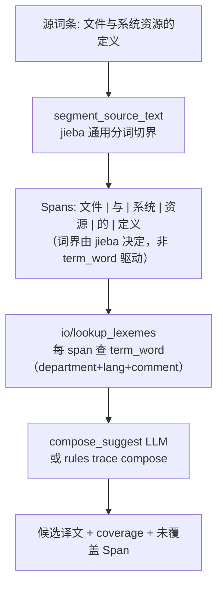

| Span | 库中命中 | 俄文示例（示意） |
|------|----------|------------------|
| 文件 | 术语「文件」 | файл |
| 系统 | 术语「系统」 | система |
| 资源 | 术语「资源」 | ресурс |
| 定义 | 来自「实时库定义」等复合词条的元词义项 | определение |
| 与 / 的 | 连接词（规则表或 LLM 形态 glue） | 语法连接 |

**coverage** 指标：`已覆盖字符数 / 源词条长度`；低于阈值不走 auto，进人工或 LLM 补全。

---

## 元词词典（Term Lexicon）— Phase 2 数据设计

术语库 `t_translate` 是 **短语级词典**（一条 entry 一个完整词条）。元词层在其上再建 **「可复用最小语义单位」** 索引。

### 概念分层

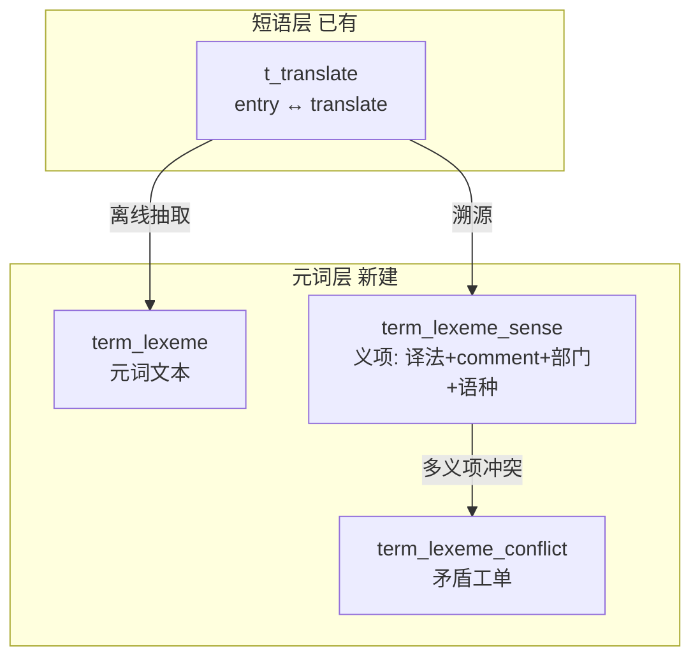

### 建议表结构（MySQL，Agent 侧新表）

**`term_lexeme`** — 元词主表

| 字段 | 说明 |
|------|------|
| `id` | PK |
| `lexeme_text` | 元词，如 `文件`、`定义`；**不再往下拆**（避免丢词义） |
| `lexeme_type` | `term` / `glue`（与、的）/ `compound_fragment` |
| `created_at` | |

**`term_lexeme_sense`** — 义项（同词不同 comment/部门/语种可多行）

| 字段 | 说明 |
|------|------|
| `id` | PK |
| `lexeme_id` | FK |
| `source_translate_id` | 来源 `t_translate.id`（溯源） |
| `target_lang` | 俄文/英文… |
| `department` | `visual_range`，可空=全局 |
| `comment` | 与源词条 `remark` / 释义 comment **绑定**，消歧 |
| `translate` | 该义项下译法 |
| `status` | `approved` / `pending` / `deprecated` |

**`term_lexeme_conflict`** — 矛盾工单

| 字段 | 说明 |
|------|------|
| `id` | PK |
| `lexeme_id` | |
| `target_lang`, `department` | 矛盾作用域 |
| `sense_ids` | JSON 冲突义项 id 列表 |
| `conflict_type` | `translate_mismatch` / `comment_ambiguous` / `department_overlap` |
| `resolution` | `open` / `human_resolved` / `llm_suggested` |
| `resolved_by`, `resolved_at` | |

**设计要点（用户要求）**：
- 同一 `lexeme_text` + 不同 `comment` → **多行 sense**，不强行合并
- 现有库「很乱」→ Phase 2 建库时 **全量标 `pending`**，仅 `translate_state=3` 且人工确认过的升 `approved`
- 矛盾不阻塞读：Agent 用 `approved` 义项；遇多义项未消解 → `needs_human` + 矛盾 id

### 离线建库 Job（Phase 2）

1. 扫描 `t_translate`（`delete_state=0`, `translate_state=3`）
2. **通用分词切界** 从每条 `entry` 抽取候选元词（与运行时 **同一 jieba segment** 函数，见 3c-0）
3. 写入 `term_lexeme` + `term_lexeme_sense`（带 `source_translate_id`、`comment`←`remark`）
4. 同 scope 下 `translate` 不一致 → 写 `term_lexeme_conflict`

**P2 现网** [`build_word_index`](terminology-agent/scripts/build_word_index.py) 当前 `word == entry` 整句入库；jieba 切界后 lookup 单字/词片，依赖 `term_word` 中 **存在对应独立条目**（如 t_translate 里已有「文件」「系统」行）。未来元词 ETL 可批量补原子词行，但 **不改变 jieba 切界原则**。

Java 侧 HanLP（[`TermProcessUtils.java`](translationtoolservice/src/main/java/com/shr/translationtoolservice/util/TermProcessUtils.java)）用于 **相似度**；Agent Python 侧 **3c-0 起** 用 **jieba 默认词典** 切界（不 `load_userdict`）。

---

## 判断分层：rules / LLM / human（全链路纪律）

对齐 nodes/README + 灵感池 **A/F** + 用户 skill（Phase 4 细化）：

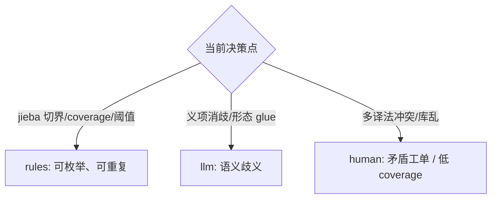

| 决策点 | rules | LLM | human |
|--------|-------|-----|-------|
| 拆解 Span | **jieba 通用分词**（`segment_source_text`） | 未命中 span 整句 LLM | 新复合词入库裁定 |
| 义项选择 | 唯一 approved sense | comment 语境消歧 | conflict 工单 |
| 全文 exact/fuzzy | 保留 Phase 1 路径 | — | — |
| 拼装 glue | 连接词映射表 | **Phase 3c：LLM 受约束拼装（词片作术语约束）** | conflict 工单 |
| 置信路由 | threshold | Judge | 终局 review |
| 元词矛盾 | 检测规则 | 合并建议（可选） | **Phase 4 前端** |

**待用户提供 skill**：Phase 4 将 skill 沉淀为 `references/lexicon-curation-rules.md` + `rules/` 节点单测用例。

---

## 意图层 == 编排层（延续 v2，扩展方向意图）

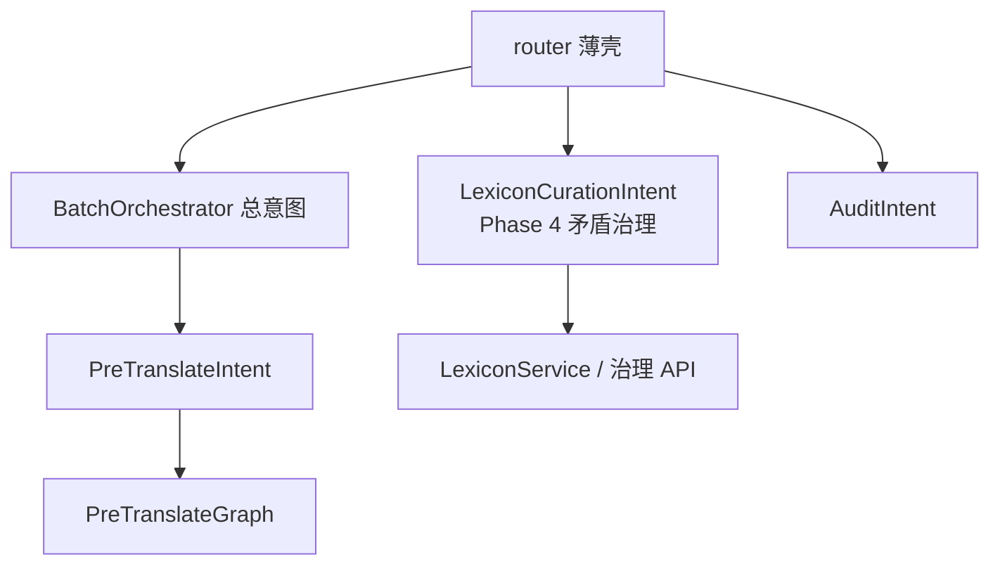

- **PreTranslateIntent**：单条预翻译，dispatch 图
- **LexiconCurationIntent**（Phase 4 新增）：矛盾列表、裁定、合并义项；**不与** batch 链式调用
- **AuditIntent**：终局审核入库（已有）

---

## PreTranslateGraph 检索漏斗（Phase 1 基线 → Phase 3 增强）

### Phase 1 路径（先交付）

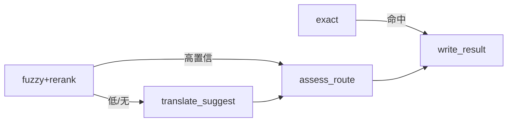

无 `[Agent]` 占位；`retrieval_method`: `exact` | `fuzzy` | `none`。

### Phase 3 增强路径（接入拆解）

在 `exact` 未命中后、走 fuzzy 之前插入 **DecomposeCompose 子图**：

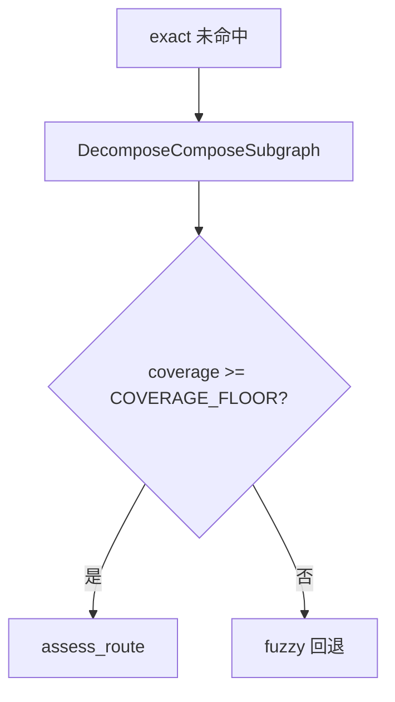

子图内部：`decompose_entry` → `lookup_lexemes` → `compose_candidate` →（可选）`llm/disambiguate_sense`

灵感来源：附录 **H**（词典分词、子图封装、Map-Reduce 查义项）。

---

## 人机「4→2」与不满意处置（不变）

- Agent：**RetrieveRank（含拆解）** + **TranslateJudgeRoute**
- 人：只审终局；L1 调参 → L2 改正 → L3 Darwin 归因

Phase 4 新增：元词矛盾页面 = **库治理** 的人工环，与单条预翻译终局审核分离。

---

## Phase 分阶段实施清单

### Phase 1 — 图合并 + 编排分层（2–3 天量级）

**目标**：单一流水线，删除 `TermLearningGraph`，无 `[Agent]` 占位。

**不依赖**元词库；为 Phase 3 预留 `retrieval_method: decomposed` 枚举位。

> 下文 **「Phase 1 实现详案」** 含目录结构、TDD 顺序、手工测试步骤；确认后说「执行 Phase 1」开始编码。

---

## Phase 1 实现详案

### 0. 命名对照（避免混淆）

| 名称 | 含义 | 状态 |
|------|------|------|
| **阶段一（API 清理）** | 删 `/run`、batch body 收紧 | **已完成** |
| **Phase 1（本详案）** | PreTranslateGraph + orchestration | **待做** |

### 1. 交付标准（Definition of Done）

- [ ] `POST /agent/pre-translate/batch` 行为与现网契约一致（`agent_meta` 六字段、`auto_count`/`pending_count`）
- [ ] 无命中时 **`retrieval_method=none`**，**禁止** `[Agent] xxx` 与 `hybrid`
- [ ] 无 LLM Key：无命中 → `needs_human`，`suggested_translation` 可为 `null`，`reasoning`/`error` 说明原因
- [ ] 有 LLM Key：无命中 → 走 `translate_suggest`（Phase 5 再加 Judge）
- [ ] `TermLearningGraph` 及 `discover`/`update_termstore`/`find_by_chinese` 已删除
- [ ] `pytest -v` 全绿（无需 MySQL / LLM Key）
- [ ] 手工：OpenAPI + 工作台 PreTranslateModal 至少跑通 exact / fuzzy / no-match 三场景

### 2. 目标目录结构

```
terminology-agent/app/
├── orchestration/
│   ├── __init__.py
│   ├── batch_orchestrator.py      # 总意图：过滤、循环、计数
│   └── intentions/
│       ├── __init__.py
│       └── pre_translate.py       # 方向意图：单条 → graph.run → agent_meta
├── graph/
│   ├── pre_translate_graph.py     # 新：替代 graph.py TermLearningGraph
│   ├── state.py                   # PreTranslateState（重命名/扩展 TermState）
│   ├── routes.py                  # route_after_retrieve（删 route_after_discover）
│   ├── retrieval_helpers.py       # _strip_placeholders / _similarity（从 service 迁出）
│   └── nodes/
│       ├── io/retrieve_similar.py
│       ├── rules/rerank_candidates.py
│       ├── llm/translate_suggest.py   # 复用 suggest 逻辑，仅 none 路径
│       ├── workflow/assess_route.py
│       └── io/write_result.py
├── services/
│   └── pre_translate_service.py   # 薄门面 → BatchOrchestrator（或 router 直调 orchestrator）
└── **/tests/                      # 见 TDD 节
```

**删除**（Phase 1 末）：

- [`graph/graph.py`](terminology-agent/app/graph/graph.py)（`TermLearningGraph`）
- [`nodes/io/discover.py`](terminology-agent/app/graph/nodes/io/discover.py)
- [`nodes/io/update_termstore.py`](terminology-agent/app/graph/nodes/io/update_termstore.py)
- [`nodes/workflow/review.py`](terminology-agent/app/graph/nodes/workflow/review.py)（旧 Graph 用）
- `term_repo.find_by_chinese`
- [`graph/tests/test_term_learning_graph.py`](terminology-agent/app/graph/tests/test_term_learning_graph.py)

**保留**（Phase 5 复用）：`llm/suggest.py`、`prompts/suggest.py`、`rules/analyze_context.py`（暂不接入 P1 主图）。

### 3. 图与路由（实现要点）

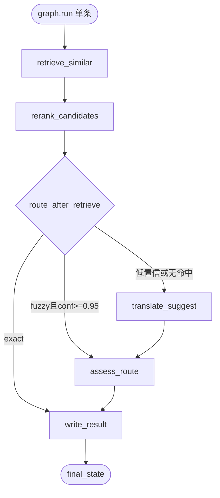

**`route_after_retrieve`**（只读 state，写在 [`routes.py`](terminology-agent/app/graph/routes.py)）：

| 条件 | 下一节点 |
|------|----------|
| `retrieval_method == "exact"` | `write_result`（跳过 assess 亦可，state 内 conf=1.0） |
| `retrieval_method == "fuzzy"` 且 `retrieval_confidence >= FUZZY_AUTO_FLOOR`（0.95） | `assess_route` |
| 否则 | `translate_suggest` → `assess_route` |

**`assess_route`**：`final_confidence >= confidence_threshold` → `review_status=auto_approved`，否则 `needs_human`。

**`write_result`**：

- `auto_approved`：不写 audit（与现逻辑一致）
- `needs_human`：调 `create_pretranslate_audit`（字段与现 [`pre_translate_service.py`](terminology-agent/app/services/pre_translate_service.py) L119–134 对齐）

**`translate_suggest`（无命中路径）**：

- 有 `LLM_API_KEY`：调用现有 suggest 节点逻辑，`target_lang` 从 state 传入 prompt（P1 可先最小改 prompt）
- 无 Key：`suggested_translation=None`，`confidence=0`，`error="LLM not configured"`，仍 `needs_human`

### 4. 编排层调用链

```python
# router.py
result = await BatchOrchestrator(session).run_batch(...)

# batch_orchestrator.py
for entry in entries:
    if entry.get("parentID") or not entry.get("entry"):
        continue
    item = await PreTranslateIntent(session).run_one(entry, batch_meta...)
    # 汇总 auto_count / pending_count / list

# pre_translate.py
final_state = await PreTranslateGraph().run(...)
return map_state_to_agent_meta(final_state, entry)
```

`map_state_to_agent_meta` 集中维护六字段映射，避免 router/service 重复。

### 5. TDD 开发顺序（红 → 绿 → 重构）

原则：**先写失败测试，再写最小实现**；每层 mock 下一层，不连 MySQL。

#### 5.1 迁移纯函数（已有绿测试）

| 步骤 | 动作 | 测试 |
|------|------|------|
| 1 | 将 `_strip_placeholders`、`_similarity` 迁到 `graph/retrieval_helpers.py` | 现有 [`test_helpers.py`](terminology-agent/app/services/tests/test_helpers.py) 改 import 路径，**保持绿** |
| 2 | `service` / 节点均从 helpers import | — |

#### 5.2 路由层 `@pytest.mark.graph`

新建 [`graph/tests/test_pre_translate_routes.py`](terminology-agent/app/graph/tests/test_pre_translate_routes.py)：

| 用例（先 RED） | 输入 state | 期望 |
|----------------|------------|------|
| `test_route_exact_to_write` | `retrieval_method=exact` | `"write_result"` |
| `test_route_fuzzy_high_to_assess` | `fuzzy`, conf=0.96 | `"assess_route"` |
| `test_route_fuzzy_low_to_suggest` | `fuzzy`, conf=0.7 | `"translate_suggest"` |
| `test_route_none_to_suggest` | `none`, conf=0 | `"translate_suggest"` |

实现 `route_after_retrieve` 后变绿。

#### 5.3 节点单测（mock Repo / LLM）

新建 [`graph/tests/test_retrieve_similar_node.py`](terminology-agent/app/graph/tests/test_retrieve_similar_node.py) 等：

| 用例 | Mock | 断言 |
|------|------|------|
| exact 命中 | `find_exact` 返回行 | `confidence=1.0`, `method=exact` |
| fuzzy 命中 | `find_exact=None`, fuzzy 列表 | `method=fuzzy`, `similar_terms` 非空 |
| 无命中 | 两者空 | `method=none`, `confidence=0`, **无** `[Agent]` 前缀 |
| rerank 排序 | 两个 fuzzy 候选 | 最高分候选成为 `suggested_translation` |

`translate_suggest`：mock `ChatOpenAI`（参考现有 [`test_llm_suggest_settings.py`](terminology-agent/app/graph/tests/test_llm_suggest_settings.py)）。

`assess_route`：threshold=0.8，conf 0.9 → auto；0.5 → needs_human。

`write_result`：auto 不调 `create_pretranslate_audit`；needs_human 调一次。

#### 5.4 图集成测

新建 [`graph/tests/test_pre_translate_graph.py`](terminology-agent/app/graph/tests/test_pre_translate_graph.py)：

- mock 整个 `TermRepository` 注入 config
- 跑 `PreTranslateGraph().run(...)` 断言 `final_state.review_status` 与 `trace` 至少 2 步（Retrieve + Assess/Write）

#### 5.5 编排层 `@pytest.mark.service`

迁移/新建 [`orchestration/tests/test_batch_orchestrator.py`](terminology-agent/app/orchestration/tests/test_batch_orchestrator.py)：

| 用例 | 说明 |
|------|------|
| `test_skips_child_entries` | 从现 [`test_pre_translate_service`](terminology-agent/app/services/tests/test_pre_translate_service.py) 迁移 |
| `test_exact_match_auto_approved` | 同上，mock graph 或 repo |
| `test_fuzzy_respects_threshold` | pending + audit |
| `test_no_match_no_agent_placeholder` | **改断言**：`method=none`，`suggested_translation` 不含 `[Agent]` |
| `test_agent_meta_shape` | 六字段不变 |

`conftest.py` 增加 `batch_orchestrator` fixture；`pre_translate_service` 可保留为 orchestrator 别名直至删 service。

#### 5.6 API 层 `@pytest.mark.api`

现有 [`test_router.py`](terminology-agent/app/api/tests/test_router.py) **应无需改断言**（monkeypatch 目标改为 `BatchOrchestrator.run_batch`）。

新增（可选）：集成测不 mock service，mock graph factory。

#### 5.7 TDD 执行节奏（建议 6 个 commit 粒度）


每 commit 前：`pytest -v` 全绿。

### 6. 行为变更对照（测试必须更新）

| 场景 | 现行为（阶段一后） | Phase 1 目标 |
|------|-------------------|--------------|
| 无命中 | `hybrid`, conf=0.45, `[Agent] 词条` | `none`, conf=0, 无占位译文 |
| 无命中 + 有 LLM | 同上 | suggest 译文，conf 由 LLM/规则赋值，通常 `< threshold` → pending |
| exact | 不变 | 不变，0 LLM |
| fuzzy 低置信 | 不变 | 不变 |

[`test_no_match_low_confidence_pending`](terminology-agent/app/services/tests/test_pre_translate_service.py) **必须改**（这是 TDD 红测试的第一处）。

### 7. 手工测试（开发完成后）

#### 7.1 自动化冒烟（无 UI）

```powershell
cd terminology-agent
pytest -v                                    # 全量，无需 MySQL
pytest app/graph/tests -v                    # 图与路由
pytest app/orchestration/tests -v            # 编排（新建后）
pytest app/api/tests/test_router.py -v       # HTTP 契约
```

#### 7.2 本地 Agent + MySQL

```powershell
# 根目录
pnpm infra                    # 或 docker compose up -d mysql
cd terminology-agent
copy .env.example .env        # 填 MYSQL_* ；LLM 测 no-match 时填 LLM_API_KEY
uvicorn app.main:app --host 0.0.0.0 --port 18002 --reload
```

浏览器打开 http://localhost:18002/docs

#### 7.3 OpenAPI 三场景

**A. 精确匹配（期望 auto）**

```http
POST /agent/pre-translate/batch?confidenceThreshold=0.8&taskID=task-demo
Content-Type: application/json

{
  "entries": [{"id": "e1", "entry": "<库中已有完全一致 entry>", "russian": ""}],
  "target_lang": "俄文",
  "department": "通用平台部"
}
```

检查：`data.auto_count=1`，`list[0].agent_meta.review_status=auto_approved`，`retrieval_method=exact`。

**B. 模糊低置信（期望 pending）**

用相似但非 exact 的 entry → `needs_human`，`term_agent_audit` 新增一行。

**C. 无命中（期望 none + 无占位）**

```json
{ "entries": [{"id": "e2", "entry": "Phase1测试全新词条XYZ", "russian": ""}] }
```

检查：`retrieval_method=none`；`suggested_translation` **不是** `[Agent]...`；无 Key 时可为 null。

验证 audit 表：

```sql
SELECT source_text, retrieval_method, confidence, suggested_translation, llm_reasoning
FROM term_agent_audit ORDER BY created_at DESC LIMIT 5;
```

#### 7.4 全栈 UI（工作台 + 术语学习）

```powershell
cd F:\Documents\Repertory\Sieyuan\translationtool
pnpm dev:ui-agent    # 或 dev:agent + 已有 UI
# → http://localhost:18000  登录 admin / admin123
```

| 步骤 | 操作 | 预期 |
|------|------|------|
| 1 | 打开翻译任务 → 预翻译 → 选 **Agent翻译** | 调用 `/agent/pre-translate/batch` |
| 2 | 高置信词条 | 俄文列自动回填 |
| 3 | 低置信/无命中 | 弹窗提示 pending_count；不写回翻译列 |
| 4 | 术语学习页 | 待审核列表出现新记录，`similar_terms` Popover 正常 |
| 5 | 确认/拒绝 | review API 正常，approved 写入 `t_translate` |

DevTools Network：确认 batch body 为 `{ entries, task_name, ... }` 对象，非纯数组。

#### 7.5 Trace Demo（可选）

```powershell
# VS Code / Cursor 打开 terminology-agent/devtools/trace_agent_demo.py
# 逐 cell 运行；Phase 1 末改为只演示 PreTranslateGraph + collect_pretranslate_trace
```

确认 trace 含 `RetrieveSimilar` / `AssessConfidence` 或新 stage 名与图节点一致。

#### 7.6 手工测试检查表

| # | 场景 | 通过 |
|---|------|------|
| 1 | pytest 全绿 | ☐ |
| 2 | exact → auto_count+1 | ☐ |
| 3 | fuzzy 低 → pending+audit | ☐ |
| 4 | no match → none，无 `[Agent]` | ☐ |
| 5 | 无 LLM Key 时 no match 不崩溃 | ☐ |
| 6 | UI Agent 预翻译端到端 | ☐ |
| 7 | 术语学习 review approved | ☐ |
| 8 | `/docs` 无 `/term-learning/run` | ☐ |

### 8. Phase 1 明确不做

- 元词词典表 / 拆解拼装（Phase 2–3）
- `judge_translation`（Phase 5）
- FAISS（Phase 6）
- 矛盾治理前端（Phase 4）
- LangGraph `interrupt()` / checkpoint 持久化（附录 D，后续）

---

### Phase 2 — 元词词典数据层（较大，可拆 2a/2b）

**2a  schema + repository**

- Alembic/SQL 迁移：`term_lexeme`、`term_lexeme_sense`、`term_lexeme_conflict`
- `LexiconRepository`：按 lexeme + lang + department 查 sense；列 open conflicts

**2b  离线建库**

- `devtools/build_lexicon_index.py`：扫 `t_translate` → Trie → 写元词表
- 矛盾检测批处理；初始 sense 多为 `pending`
- 只读 API（可选）：`GET /agent/lexicon/lexeme/{text}` 供调试

**交付物**：库里有元词索引，Agent 尚未走拆解路径。

---

### Phase 3 — 拆解 + 拼装接入图（核心算法）

1. `segment_source_text`（**jieba.tokenize**，默认词典）→ `spans[]`（text, start, end）
2. `io/lookup_lexemes.py`：每 span 批量查 approved senses；多义项 → 标 `ambiguous`
3. `rules/compose_candidate.py`：按 Span 顺序拼接；连接词用 glue 表
4. `llm/disambiguate_sense.py`（可选）：comment/上下文消歧；失败 → `needs_human`
5. 接入 `PreTranslateGraph`；state 增加 `spans`, `coverage`, `decomposed_translation`
6. 用例：`文件与系统资源的定义` 进 `trajectory_cases.json`

**Phase 3b MVP 现状（待 3c-0 替换）**：[`decompose.py`](terminology-agent/app/graph/pre_translate/utils/decompose.py) 与 Grep [`grep_retrieve.py`](terminology-agent/app/graph/pre_translate/utils/grep_retrieve.py) 仍用 **Trie 最长匹配切界** — 与用户确认的架构不符，**3c-0 首要任务**。

**路由**：`coverage >= COVERAGE_FLOOR`（建议 0.85）且无语义冲突 → 可 auto；否则 fuzzy/LLM/人工。

**Phase 3b MVP 局限（已知）**：[`compose.py`](terminology-agent/app/graph/pre_translate/utils/compose.py) 使用 `"".join()`，英文产出 `FileSystem` 而非 `File System`；业界实践要求 **词片 lookup + LLM 上下文拼装**（Smartling AI GTI / Phrase glossary）。

---

### Phase 3c — 拆解切界改版 + LLM 受约束拼装（**设计详案**）

#### 3c.0 拆解切界改版（jieba 通用分词 — **用户确认，先于 compose_suggest**）

**问题**：3b MVP 用 `term_word` Trie **最长匹配主导切界**（[`decompose.py`](terminology-agent/app/graph/pre_translate/utils/decompose.py)、Grep [`extract.py`](terminology-agent/app/shared/term_word/extract.py)）。术语库子串会 **抢切界**，损失语义：

| 源文 | Trie 切界（错误） | jieba 切界（正确） |
|------|-------------------|-------------------|
| 计算机器 | 计算机 + 器（库有「计算机」） | 计算 + 机器 |
| 文件系统资源 | 可能被库内短词带偏 | 文件 + 系统 + 资源（或 jieba 合词变体） |

**原则（两阶段，职责分离）**：

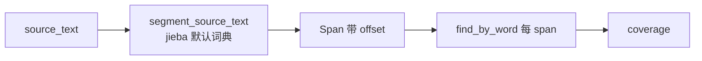

| 阶段 | 职责 | 实现 |
|------|------|------|
| **切界** | 猜语义词界 | **jieba** `tokenize`（**不** `load_userdict`） |
| **术语对齐** | 查 approved 译法 | `WordRepository.find_by_word(word=span.text)` |
| **拼装** | 目标语自然短语 | 3c-1~4 `compose_suggest` LLM |

**共用函数**（Grep + decompose **同一 SSOT**）：

- 新建 [`shared/term_word/segment.py`](terminology-agent/app/shared/term_word/segment.py)（或 `graph/pre_translate/utils/segment.py`）
- `segment_source_text(text) -> list[tuple[str, int, int]]` — 基于 `jieba.tokenize`
- [`decompose_to_spans`](terminology-agent/app/graph/pre_translate/utils/decompose.py) 改为：segment → Span 列表（**不再接收 Trie**）
- [`grep_retrieve`](terminology-agent/app/graph/pre_translate/utils/grep_retrieve.py) / [`retrieve_similar._grep_retrieve`](terminology-agent/app/graph/pre_translate/nodes/features/io/retrieve_similar.py) 改为 segment + lookup；**整句 exact** 仍 `lookup(source_text)` 优先
- [`trie_cache`](terminology-agent/app/repository/trie_cache.py)：**运行时切界路径不再依赖**；可保留供调试/子串 LIKE 或 Phase 3d

**依赖**：`requirements.txt` / `pyproject.toml` 增加 `jieba`。

**测试**：

| 用例 | 断言 |
|------|------|
| `计算机器` | spans 含「计算」「机器」，**不含**「计算机+器」 |
| `文件与系统资源的定义` | jieba 切界 + lookup 命中「文件」「系统」「资源」「定义」（库有对应行时） |
| Grep 与 decompose | 同一 source 产出相同 token 集合 |

**ADM 测试数据影响**：[`fix_adm_test_data.py`](terminology-agent/devtools/fix_adm_test_data.py) 中为规避 Trie 抢词的 **直接拼接触发串**（如 `ADM/3B-文件ADM/3B-系统`）在 jieba 下 **可能失效**；3c-0 后改用 **自然中文复合句** + 独立 seed 词条（「文件」「系统」等）验证 hybrid 路径。

**明确不做（3c-0）**：

- `load_userdict(term_word)` 主导切界（与用户「纯通用词频」冲突）
- Trie / pyahocorasick **最长匹配** 作为切界主路径

**可选 Phase 3d（术语对齐增强，非切界）**：jieba 切界后，对相邻 span 尝试 **合并** 再 lookup（如「文件」+「系统」→ 查「文件系统」）；仅当合并串在 term_word 存在时才合并，**不改变 jieba 原始切界 trace**。

#### 3c.1 设计动机（LLM 拼装层）

| 层级 | 职责 | 产出示例（英译） |
|------|------|------------------|
| **Rules**（3b 保留 + 3c-0 改切界） | jieba 切界 + 词片 lookup + coverage + trace compose | `decomposed_translation` = `FileSystem`（仅 trace） |
| **LLM**（3c-2 新增） | 在 mandatory 词片约束下按目标语语法成句 | `suggested_translation` = `File System` / `Definition of file system resources` |

业界对齐：术语库给**词典原形**，语法/空格/介词由 **AI-Enhanced Glossary Insertion** 在整句上下文完成（Smartling / Phrase），不做 post-hoc 字符串 join。

#### 3c.2 主图变更（相对 3b MVP）

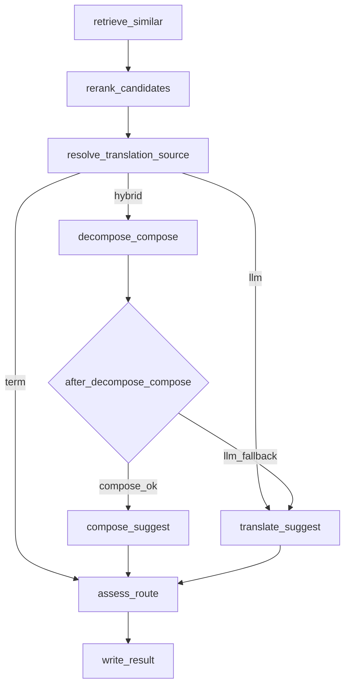

**唯一连边改动**：[`builder.py`](terminology-agent/app/graph/pre_translate/builder.py) L55 `compose_ok` 从 `assess_route` 改为 `compose_suggest`；新增 `compose_suggest → assess_route`。

[`after_decompose_compose`](terminology-agent/app/graph/pre_translate/edges/after_decompose_compose.py) 路由条件**不变**（仍看 coverage + decomposed 非空）；变的是 compose_ok 的下一跳。

#### 3c.3 节点职责拆分

**`decompose_compose`（改）** — 纯 rules，不调 LLM

| 写入 state | 说明 |
|------------|------|
| `spans` | 词片 + offset + translate + ambiguous |
| `coverage` | 已译字符 / 原文长度 |
| `decomposed_translation` | [`compose_translation`](terminology-agent/app/graph/pre_translate/utils/compose.py) 确定性结果，**仅供 trace/LLM 参考** |
| `retrieval_method` | coverage 达标 → `decomposed` |
| `llm_detail` | `词片覆盖 coverage=XX%，待 LLM 受约束拼装` |
| ~~`suggested_translation`~~ | **删除**（达标时不再写入） |
| ~~`confidence`~~ | **删除**（改由 compose_suggest 写入） |

**`compose_suggest`（新建）** — LLM 受约束拼装

| 读 | 写 |
|----|-----|
| `source_text`, `target_lang`, `spans`, `decomposed_translation`, `coverage` | `suggested_translation`, `confidence`, `llm_detail`, `trace` |

#### 3c.4 Prompt 设计

新建 [`prompts/compose_suggest.py`](terminology-agent/app/graph/pre_translate/prompts/compose_suggest.py)：

**System（按 target_lang 注入）**

```
您是工业软件 i18n 专家。任务：将中文词条译为{target_lang}，
在「强制术语表」约束下输出自然、符合目标语习惯的短语/短句。

规则：
1. 强制术语表中每个译法必须出现（允许合理屈折/大小写，不可替换同义词）。
2. 目标语为空格分写语言（英文/俄文/法文/西文）：词与词之间加空格；按需补介词（of/for/in 等）。
3. 禁止简单拼接 mandatory 译法（如 File+System→FileSystem），除非术语表明确为品牌/ProductName。
4. 保留 %1、%2 等占位符位置与数量。
5. 未在术语表中的连接字（与/的/…）由你按语法翻译，勿保留中文。
6. 只输出 JSON，无 markdown。

输出：{"translation":"...","reasoning":"...","terms_used":["File","System"]}
```

**User message 结构**

```
Chinese term: {source_text}
Target language: {target_lang}
Coverage: {coverage:.0%}（词片命中比例，供你判断可信度）

Mandatory terminology（必须全部使用）:
| source_span | required_translation | status |
| 文件 | File | hit |
| 系统 | System | hit |
| 与 | (no glossary — translate as connector) | glue |

Naive draft（仅供参考，禁止照搬）: FileSystem

Produce the best natural translation.
```

**Span 分类写入 prompt**

| span 类型 | 条件 | prompt 行 |
|-----------|------|-----------|
| mandatory | `translate` 且非 ambiguous | required_translation 列 |
| ambiguous | `ambiguous=True` | 标注「多译法冲突，勿选用」 |
| glue | 无 translate、单字符连接词 | 「translate as connector」 |
| oov | 无 translate、非标点 | 「translate if possible, else transliterate」 |

#### 3c.5 置信度与 fallback

新增常量（[`constants.py`](terminology-agent/app/graph/pre_translate/constants.py)）：

```python
LLM_COMPOSE_CAP: float = 0.88          # 低于 exact(1.0)，高于纯 LLM(0.65)
LLM_COMPOSE_FALLBACK_CONF: float = 0.72  # LLM 失败但用 decomposed 兜底时的置信度
```

| 场景 | suggested_translation | confidence | review 倾向 |
|------|----------------------|------------|-------------|
| LLM 成功 + 术语校验通过 | LLM translation | `min(coverage_to_confidence(cov), LLM_COMPOSE_CAP)` | ≥0.8 可 auto |
| LLM 成功 + 术语缺失 | fallback `decomposed_translation` | `LLM_COMPOSE_FALLBACK_CONF` | 通常 needs_human |
| LLM 失败 / 无 API Key | fallback `decomposed_translation` | `LLM_COMPOSE_FALLBACK_CONF` | needs_human + error 说明 |
| coverage 未达标 | 不走 compose_suggest，整句 `translate_suggest` | 0.65 | 不变 |

**术语校验（rules，轻量）**：LLM 返回后检查每个 mandatory `translate` 是否出现在结果中（case-insensitive）；失败则 fallback + 降置信，不二次 LLM（控制成本）。

#### 3c.6 State / API / UI 映射

| state 字段 | 页面表现 |
|------------|----------|
| `retrieval_method=decomposed` | 术语学习「检索方式」→ **拆解拼装** |
| `suggested_translation` | 工作台翻译列 / 术语学习建议翻译 |
| `decomposed_translation` | 仅 trace / 调试 API（前端暂不展示） |
| `coverage` | Agent 说明中的 `coverage=85%` |
| `llm_detail` | compose 理由；经 write_result → `llm_reasoning` → 审核意见或 Agent 说明 |
| `translation_source=hybrid` | 「基于混合检索：…」 |

**不改** `agent_meta` 六字段契约；不新增 `retrieval_method` 枚举值。

#### 3c.7 代码结构（新建/修改清单）

| 序号 | 文件 | 动作 |
|------|------|------|
| 0 | `shared/term_word/segment.py` | 新建 `segment_source_text`（jieba）；改 [`decompose.py`](terminology-agent/app/graph/pre_translate/utils/decompose.py)、[`grep_retrieve.py`](terminology-agent/app/graph/pre_translate/utils/grep_retrieve.py)、[`extract.py`](terminology-agent/app/shared/term_word/extract.py) |
| 1 | [`decompose_compose.py`](terminology-agent/app/graph/pre_translate/nodes/features/workflow/decompose_compose.py) | 达标时不写 suggested/confidence |
| 2 | `prompts/compose_suggest.py` | 新建 prompt 构建 |
| 3 | `nodes/features/llm/compose_suggest.py` | 新建节点；复用 translate_suggest 的 ChatOpenAI 调用模式 |
| 4 | `utils/compose_validate.py`（可选） | `validate_mandatory_terms(output, spans)` |
| 5 | [`builder.py`](terminology-agent/app/graph/pre_translate/builder.py) | 注册节点 + 连边 |
| 6 | [`constants.py`](terminology-agent/app/graph/pre_translate/constants.py) | LLM_COMPOSE_* |
| 7 | [`after_decompose_compose.py`](terminology-agent/app/graph/pre_translate/edges/after_decompose_compose.py) | 注释：compose_ok → compose_suggest |
| 8 | [`compose.py`](terminology-agent/app/graph/pre_translate/utils/compose.py) | 保留；docstring 标明「内部 trace，非最终译文」 |

**可选重构（非阻塞）**：从 `translate_suggest` 抽出 `invoke_llm_json(system, user) -> (translation, reasoning)` 供两节点共用。

#### 3c.8 测试策略（TDD 顺序）

0. **`test_segment_source_text.py`** — `计算机器`→「计算|机器」；Grep/decompose 共用同一函数
1. **`test_compose_suggest_prompt.py`** — span 表渲染、英文/俄文 system 差异、占位符保留说明
2. **`test_compose_validate.py`** — mandatory 术语校验通过/失败
3. **`test_compose_suggest_node.py`** — mock LLM 返回 `File System`；无 Key → fallback decomposed
4. **改 [`test_pre_translate_graph.py`](terminology-agent/app/graph/pre_translate/tests/test_pre_translate_graph.py)** — patch `compose_suggest_node`；断言 `suggested_translation != decomposed_translation` 且含空格
5. **改 [`trajectory_cases.json`](terminology-agent/app/evals/trajectory_cases.json)**：

```json
{
  "id": "decompose-compound-two-words",
  "expected_decomposed": "FileSystem",
  "expected_llm_contains": ["File", "System"],
  "expected_llm_not_equals": "FileSystem"
}
```

6. **保留 [`test_compose_coverage.py`](terminology-agent/app/graph/pre_translate/tests/test_compose_coverage.py)** 对 `compose_translation` 的确定性单测不变。

#### 3c.9 黄金用例预期（实施后）

| 源词条 | decomposed（trace） | LLM 最终（英文） | retrieval | auto? |
|--------|---------------------|------------------|-----------|-------|
| `ADM/3B-文件ADM/3B-系统` | `FileSystem` | `File System` | decomposed | 是（conf≈0.88） |
| `文件与系统资源的定义` | 含中文连接词 | `Definition of file system resources` 类 | decomposed | 视 threshold |
| `文件与系统资源的定义`（仅命中「文件」） | coverage<0.85 | 整句 LLM | hybrid→none | needs_human |

#### 3c.10 明确不做（3c 范围外）

- 完整形态学引擎 / 介词规则表（交给 LLM）
- 改 Grep/RAG **merge 与 RAG 向量逻辑**（3c-0 仅改 Grep **切界函数**，与 decompose 共用 jieba）
- Phase 5 Judge（3c 后可对 compose 结果加 judge，但不阻塞 3c）
- 前端新列展示 `decomposed_translation`（后续可选）

#### 3c.11 分词/拼装：依赖包策略（修订版）

**结论**：

| 问题 | 方案 | 说明 |
|------|------|------|
| **切界（词界）** | **jieba 默认词典** | 通用词频猜词界；**术语库不参与切界** |
| **术语 lookup** | `term_word` + `find_by_word` | 每 jieba span 查库；消歧键 comment/lang/department 不变 |
| **拼装（英文语法）** | **3c LLM `compose_suggest`** | 无成熟 pip 包；术语约束 + 上下文语法 |

**与旧 §3c.10 的差异**：此前写「应用 Trie 最长匹配、jieba 仅 OOV 辅助」——**已废弃**。用户确认：术语库驱动切界会损失语义（计算机/计算机器），应 **通用分词切界 + 术语 lookup 解耦**。

**Trie / pyahocorasick 定位变更**：

| 组件 | 旧角色 | 新角色 |
|------|--------|--------|
| 自研 [`Trie`](terminology-agent/app/shared/term_word/trie.py) | 运行时切界 + Grep 拆词 | **非切界主路径**；可选保留子串检索/调试 |
| pyahocorasick | 替换 Trie 切界 | **不优先**；3d 若做 n-gram 合并 lookup 可考虑 |
| jieba | OOV 辅助 | **切界 SSOT**（默认词典，不 userdict） |

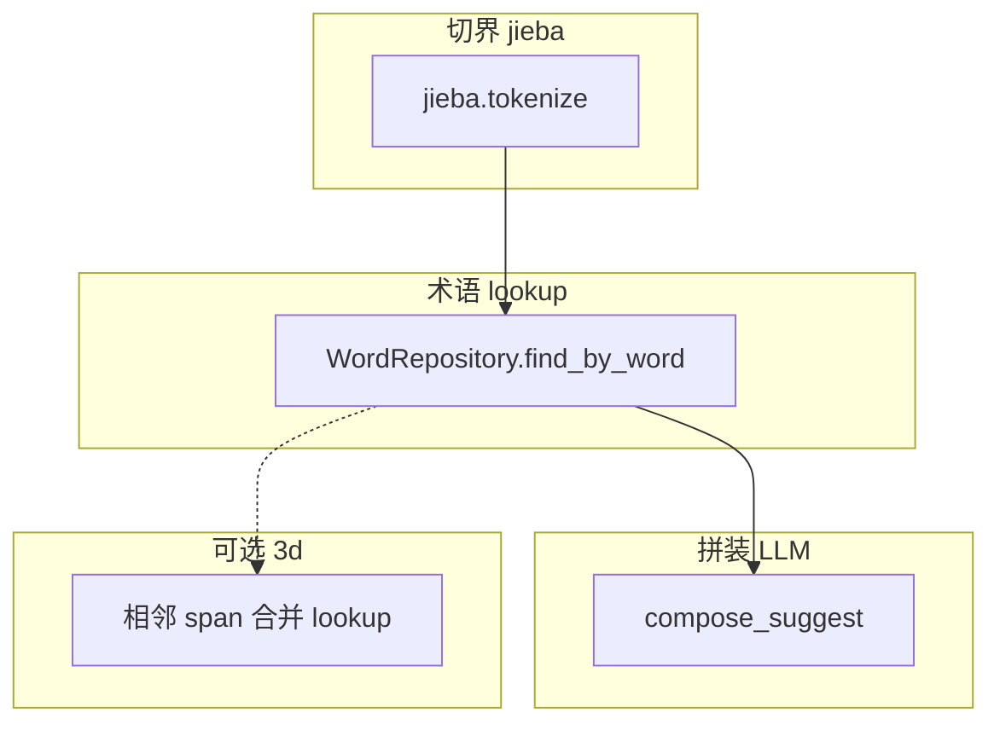

#### 3c.12 实施 commit 粒度建议

```
C0  segment_source_text(jieba) + decompose/grep 改切界 + 单测（计算机器/文件与系统…）
C1  decompose_compose 拆分 + 图测红（期望 FileSystem 失败）
C2  compose_suggest prompt + 节点 + builder 连边 → 图测绿
C3  术语校验 + fallback + constants
C4  trajectory_cases + README + 边注释
C5  ADM 种子/触发更新 + admin-proj UI 复测（todo p3c-retest-adm-matrix）
```

**验收**（与 3b 对比）：
- `ADM/3B-文件ADM/3B-系统` → 建议译文 **`File System`**，检索方式仍为「拆解拼装」
- coverage 未达标行为不变（整句 LLM）
- auto_approved 审核意见仍拷贝 reasoning

**Phase 3c 完成后**：跑 [`verify_adm_data.py`](terminology-agent/devtools/verify_adm_data.py) + admin-proj 工作台 UI 全矩阵复测。

---

### Phase 4 — 矛盾治理 + 前端 + 用户 skill

**依赖**：用户提供的 **skill**（规则节点细化、矛盾类型、裁定 UX）。

1. **后端**：`LexiconCurationIntent` + API
   - `GET /agent/lexicon/conflicts` 分页
   - `POST /agent/lexicon/conflicts/{id}/resolve`（选主义项 / 标记 deprecated）
2. **前端**（新模块，如 `translation/src/views/lexiconGovernance/`）
   - 矛盾列表：同元词多译对照
   - 详情：来源词条、comment、部门、溯源 `t_translate`
   - 裁定：人工选 canonical sense 或拆分 comment
3. **规则节点**：能规则检测的冲突类型不进 LLM；LLM 仅生成「合并建议」供人确认
4. 将 skill 内容写入 `references/lexicon-curation-rules.md`

---

### Phase 5 — Judge + Darwin + 终局增强

1. `llm/judge_translation` + 多语种 prompt
2. `review` 增加 `unsatisfied_reason`；导出 `app/evals/feedback/`
3. 轨迹 eval：拆解覆盖率、术语复用率、judge_agreement
4. darwin keep/revert 只改单一变量（prompt **或** COVERAGE_FLOOR **或** 建库规则）

可与 Phase 3 部分并行（Judge 不依赖 lexicon UI）。

---

### Phase 6 — FAISS 混合检索（可选）

1. 对 `entry` + `lexeme_text` 双索引
2. `retrieve` 子图：keyword + vector 并行 → merge → rerank（附录 B）
3. 服务 50k+ 词条规模；部门 metadata 过滤

---

## Darwin 与 Eval（跨 Phase）

| 阶段 | Eval 重点 |
|------|-----------|
| 1 | route、无占位、exact fast path 零 LLM |
| 3 | coverage、span 复用率、compose 正确性 |
| 4 | 矛盾解决率、pending sense 占比 |
| 5 | 采纳率 proxy、judge vs 人工终态 |
| 6 | 检索 recall@k、混合 vs 仅 keyword |

样本存放：`app/evals/trajectory_cases.json`、`app/evals/feedback/unsatisfied.jsonl`

---

## 风险

| 风险 | 缓解 |
|------|------|
| 元词库与短语库不一致 | sense 必须 `source_translate_id` 溯源 |
| 库乱导致海量矛盾 | Phase 2 先 `pending`；Phase 4 分批治理；Agent 只用 `approved` |
| 切界语义错误 | **jieba 通用切界**；术语库仅 lookup，不主导切界 |
| Phase 范围失控 | 严格按 Phase 交付，不跨期做 FAISS/前端 |
| skill 未就绪 | Phase 4 启动前阻塞；Phase 1–3 不依赖 |

---

# 附录：Web 研究与灵感池

> 供各 Phase 涌现选用；**不等于全部实现**。

## A. 漏斗与自适应路由

| Idea | 借鉴 |
|------|------|
| Easy/Hard 双路径 | exact / 高 coverage 拆解 = easy；低 coverage = hard |
| MAX_ITERATIONS | 拆解不重试；LLM `MAX_RETRIES=1` |
| 路由只读 state | [`routes.py`](terminology-agent/app/graph/routes.py) |

## B. 检索与重排

| Idea | 借鉴 |
|------|------|
| cross-encoder rerank | Phase 6 fuzzy/vector 后 |
| 混合检索 merge | Phase 6 |
| Extended Search 子图 | `DecomposeComposeSubgraph` 封装 |

## C. LLM-as-Judge

| Idea | 借鉴 |
|------|------|
| Grader/Generator 分工 | Phase 5 |
| rubric 分项 | terminology_reuse / placeholder / lang |
| compose 后 Judge | 拆解拼装结果也需评判 |

## D. Human-in-the-Loop

| Idea | 借鉴 |
|------|------|
| 终局审批 | 预翻译审核页 |
| 矛盾裁定页 | Phase 4 库治理（非每步 interrupt） |
| update_state | 审核改译文 |

## E. Trace 与 Eval

| Idea | 借鉴 |
|------|------|
| trace reducer | 记录 decompose spans / coverage |
| 轨迹 eval | 拆解链路累积偏差 |

## F. 成本与 Darwin 纪律

| Idea | 借鉴 |
|------|------|
| 能 rules 不 LLM | 拆解、glue、exact |
| keep/revert 单变量 | 归因后一次只改一层 |
| eval 不自动上线 | 人审样本再改 agent |

## G. 简历映射

| 简历 | Phase |
|------|-------|
| 新词条复用术语库 | 3 拆解 + 1 exact |
| 混合检索+重排 | 6 |
| LLM-as-Judge | 5 |
| 轨迹 Eval | 5 |
| 反馈回流 | L3 + darwin |
| 4→2 人机 | 终局审核 |
| 采纳率 90% | offline metric |

## H. 术语拆解与词典分词（本章重点，服务 Phase 2–3）

| Idea | 来源/实践 | 借鉴 |
|------|-----------|------|
| **通用分词切界** | jieba / HanLP 工业实践 | **切界 SSOT**：`jieba.tokenize` 默认词典；**术语库不参与猜词界** |
| **术语 lookup 解耦** | 用户反馈 2026-06-29 | 切界后每 span `find_by_word`；反例：计算机器 ≠ 计算机+器 |
| **Double-Array Trie / pyahocorasick** | 工业词典 | **非切界主路径**；可选 n-gram 合并 lookup（3d） |
| **未登录词 OOV** | 分词常规问题 | jieba 切出的无库 span → coverage 降 / LLM 整句 |
| **义项用 comment 消歧** | 用户：同词不同 comment 多行 | sense 表设计已覆盖；LLM 读 entry comment + task context |
| **覆盖度阈值** | IR 置信 | `coverage` < floor 不 auto |
| **拼装非生成** | 降低幻觉 | 已覆盖 Span 术语约束 + LLM 语法；缺口才整句 LLM |
| **Java HanLP** | 现有 `TermProcessUtils` | Java 相似度；Python Agent 切界用 jieba |
| **子图隔离** | LangChain Map-Reduce | DecomposeCompose 独立子图，单测不跑全图 |
| **并行查义项** | LangChain Blog | 多 Span `asyncio.gather` 查 sense |
| **矛盾即数据** | 用户：库乱 | conflict 表 + 治理 UI，Agent 读 snapshot（仅 approved） |

### 拆解示例数据（Phase 3 黄金用例）

```json
{
  "source_text": "文件与系统资源的定义",
  "expected_spans": ["文件", "与", "系统", "资源", "的", "定义"],
  "lexeme_hits": {
    "文件": { "translate": "…", "sense_status": "approved" },
    "系统": { "translate": "…" },
    "资源": { "translate": "…" },
    "定义": { "from_compound": "实时库定义" }
  },
  "min_coverage": 0.85
}
```

---

## 关键文件预览（按 Phase）

| Phase | 新建/大改 |
|-------|-----------|
| 1 | `orchestration/*`, `pre_translate_graph.py`, `nodes/retrieve_*`, 删 `TermLearningGraph` |
| 2 | `models/lexicon.py`, `repository/lexicon_repo.py`, `devtools/build_lexicon_index.py`, migrations |
| 3 | `nodes/rules/decompose_entry.py`, `nodes/io/lookup_lexemes.py`, `nodes/rules/compose_candidate.py`, 子图 |
| 4 | `intentions/lexicon_curation.py`, `views/lexiconGovernance/*`, 用户 skill → references |
| 5 | `nodes/llm/judge_translation.py`, `app/evals/*` |
| 6 | `retrieval/faiss_index.py`, vector retrieve 节点 |

---

## 建议执行顺序（按依赖重排）

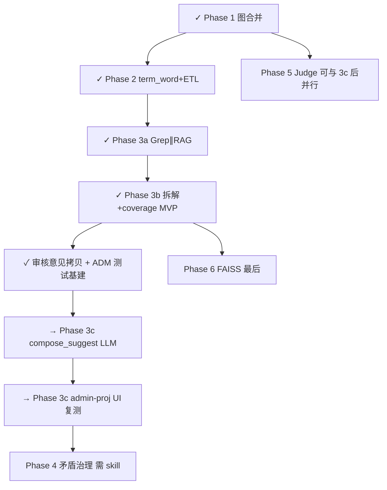

1. ~~Phase 1~~ → ~~Phase 2~~ → ~~Phase 3a~~ → ~~Phase 3b MVP~~ → ~~手动测试基建~~（**已完成**）
2. **现在做**：**Phase 3c P3b+** — 说「执行 Phase 3c」开始编码
3. **紧接着**：admin-proj 全路径 UI 复测（exact / fuzzy / decomposed / LLM / 审核意见列）
4. **之后**：等你提供 **lexicon skill** 再启动 Phase 4；Phase 5 可与 3c 后穿插；Phase 6 最后

确认后可说 **「执行 Phase 3c」** 开始 LLM 受约束拼装；或先提供 lexicon skill 以锁定 Phase 4 规则节点。
