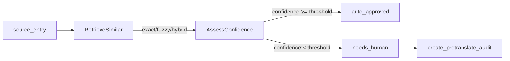

# Agent 测试与 Trace 可视化

← [[README]] · [项目根 README](../README.md) | [[references/本地开发]] · [本地开发](本地开发.md) | [[terminology-agent/README]] · [Agent README](../terminology-agent/README.md)

本文档是 **terminology-agent** 测试与 Agent 轨迹可视化的单一事实来源（SSOT）。默认 **无需 MySQL、无需 LLM Key** 即可跑完全部 **94** 个用例（LLM 节点用 mock）。

---

## 1. 概述

测试采用 **共置 `tests/`** 目录：与源码同层，改 `services/pre_translate/service.py` 时可直接打开旁边测试做 TDD 红绿。

```
terminology-agent/app/
├── conftest.py                              # 全局 fixtures
├── testing/fixtures/                        # 样例 JSON
├── services/
│   ├── pre_translate/tests/                 # PreTranslateService 契约
│   └── term_audit/tests/                    # TermAuditService 契约
├── api/tests/                               # FastAPI 路由
├── graph/pre_translate/tests/               # LangGraph 节点/边/图集成
└── schemas/tests/                           # Pydantic 契约
```

环境准备见 [[references/本地开发]] §0；安装开发依赖：

```powershell
cd terminology-agent
pip install -e ".[dev]"
```

---

## 2. 目录与 Fixtures

### 2.1 共享 Fixtures（`app/conftest.py`）

| Fixture | 用途 |
|---------|------|
| `sample_entry_oid` | 含 `%1/%2` 占位符的 OID 样例词条 |
| `sample_entries` | 从 `app/testing/fixtures/entries.json` 加载 |
| `mock_translate_entry` | 模拟 `t_translate` 精确匹配行 |
| `mock_fuzzy_entries` | 模拟模糊匹配候选 |
| `mock_repo` | AsyncMock TermRepository |
| `pre_translate_service` | 注入 mock TermRepository 的 PreTranslateService |
| `api_client` | httpx AsyncClient + dependency_overrides |
| `sample_audit_record` | 模拟 pending audit ORM 对象 |

### 2.2 样例数据

| 文件 | 内容 |
|------|------|
| `app/testing/fixtures/entries.json` | 含 OID、parentID、空 entry 边界 |
| `app/testing/fixtures/translate_rows.json` | 精确匹配术语库行 |
| `app/evals/trajectory_cases.json` | Phase 3b 拆解拼装黄金用例 |

---

## 3. 测试用例概览（94）

主要分组：

| Marker / 目录 | 数量 | 说明 |
|---------------|------|------|
| `@pytest.mark.unit` | 20+ | `utils/retrieval`、`decompose/compose/coverage`、`grep`、`merge` |
| `@pytest.mark.graph` | 22+ | edges、意图节点、assess、图集成、decompose_compose |
| `@pytest.mark.service` | 11 | `PreTranslateService` + `TermAuditService` 契约 |
| `@pytest.mark.api` | 8 | FastAPI 路由 |
| schemas / settings / word | 30+ | Pydantic、term_word ETL、trie_cache |

**PreTranslate 主链路**：`retrieve_similar`（RAG ∥ Grep）→ `rerank` → `resolve_translation_source` → term / llm / **decompose_compose** → `assess_route` → `write_result`。

### 3.1 Phase 3a / 3b 专项

```powershell
# 3a Grep + merge
pytest -k "grep or merge_candidates or entry_context" -v

# 3b 拆解拼装
pytest app/graph/pre_translate/tests/test_decompose.py -v
pytest app/graph/pre_translate/tests/test_compose_coverage.py -v
pytest app/graph/pre_translate/tests/test_lookup_lexemes.py -v
pytest app/graph/pre_translate/tests/test_after_decompose_compose.py -v
pytest app/graph/pre_translate/tests/test_pre_translate_graph.py::test_graph_decomposed_word_level -v
```

**如何判断 UI 是否在 Mock 路径**：`retrieval_method=mock_hybrid` 或 Agent 说明以 `Mock:` 开头 → 前端 API 失败回退，非真实 Agent。清空 localStorage 键 `agent-pending-audits` 后重试。

### 3.2 历史清单（已迁移）

原 `BatchOrchestrator` / `orchestration/` 测试已并入 `app/services/pre_translate/tests/`；原 `graph/tests/` 已迁入 `app/graph/pre_translate/tests/`。

---

## 4. 批量运行命令

在 `terminology-agent/` 目录下执行：

```powershell
# 全量（50 用例）
pytest -v

# 按模块
pytest app/services/pre_translate/tests -v
pytest app/services/term_audit/tests -v
pytest app/api/tests -v
pytest app/graph/pre_translate/tests -v
pytest app/schemas/tests -v

# 按 marker
pytest -m unit -v
pytest -m service -v
pytest -m api -v
pytest -m graph -v

# 关键字过滤
pytest -k "exact_match" -v
pytest -k "route_after_discover" -v
```

---

## 5. TDD 红绿工作流

1. 改 `app/graph/pre_translate/` 或 `app/services/<domain>/` 对应模块
2. **RED**：在同级 `tests/` 写失败断言
3. **GREEN**：`pytest -v` 全绿
4. **REFACTOR**：nodes/edges 分层，测试仍绿

---

## 6. Agent 轨迹可视化

除 pytest 外，还有多种方式直观观察 Agent 行为与路由决策。

### 6.1 方式对比

| 方式 | 适用场景 | 操作 |
|------|----------|------|
| **Cursor Testing 面板** | 浏览 / 点跑 50 个用例 | 侧边栏 Testing → 展开 `app/**/tests` → 点击运行 |
| **`trace_agent_demo.py`** | LangGraph 静态图 + PreTranslate 逐步 trace | 见 §6.2 |
| **FastAPI Swagger** | 在线调 API、观察 JSON 响应 | 启动 Agent 后访问 http://localhost:18002/docs |
| **术语学习前端** | 业务结果（待审核列表、置信度） | [[references/本地开发]] → http://localhost:18000 |

### 6.2 Trace Demo（`devtools/trace_agent_demo.py`）

此文件**不在 `tests/` 内**，pytest 不收集。文件顶部 markdown cell 含**新手导读**（两条 Agent 链路、如何读 `print` 输出）；每个代码 cell 前有 docstring 说明该步目的。

导出 HTML 示例：[`docs/agents/trace_agent_demo.html`](../docs/agents/trace_agent_demo.html)

在 VS Code / Cursor 中打开后逐 `# %%` cell 运行（Interactive / Run Cell）：

| Cell | 内容 | 输出 |
|------|------|------|
| **0** | 路径引导（`sys.path` 加入 `terminology-agent` 根目录） | 无输出；**必须先跑**，否则可能报 `No module named 'config.settings'` |
| 1 | LangGraph 静态图 | Mermaid PNG（discover → analyze_context → llm_suggest → …） |
| 2a | 精确匹配 PreTranslate trace | 打印 `RetrieveSimilar` → `AssessConfidence` 步骤 |
| 2b | 无命中 trace（纯函数） | 打印 confidence=0.45、`route=needs_human` |
| 3 | astream_events 占位 | 事件流格式化（后续可 mock LLM 扩展） |

```powershell
cd terminology-agent
pip install -e ".[dev]"   # 含 ipython、pillow
# 在编辑器中打开 devtools/trace_agent_demo.py
# 从 cell 0 开始逐格运行（不要跳过 cell 0）
```

**常见报错**

| 报错 | 处理 |
|------|------|
| `No module named 'config.settings'` | 先运行 **cell 0**（路径引导） |
| `asyncio.run() cannot be called from a running event loop` | cell 2a 使用 **`await`**，不要用 `asyncio.run()`（Interactive 已自带事件循环） |

### 6.3 Trace 工具 API

测试与 Demo 共用，保证「测试绿 = trace 可复现」：

| 模块 / 函数 | 作用 |
|------|------|
| `app/graph/shared/visualization.py` → `render_graph_png` | 导出 LangGraph Mermaid PNG 字节流 |
| `app/graph/pre_translate/utils/trace.py` → `build_pretranslate_trace_steps` | 根据终态 state 构建 trace 步骤列表 |
| `app/graph/pre_translate/utils/trace.py` → `collect_pretranslate_trace` | 对单条词条跑 PreTranslateGraph 并返回 trace |
| `app/graph/pre_translate/utils/trace.py` → `format_astream_events` | 将 LangGraph `astream_events` 格式化为可读文本 |

### 6.4 PreTranslate Trace 流程



每步 trace 字典示例：

```python
# RetrieveSimilar 阶段
{"stage": "RetrieveSimilar", "retrieval_method": "exact", "confidence": 1.0, ...}

# AssessConfidence 阶段
{"stage": "AssessConfidence", "threshold": 0.8, "confidence": 1.0, "route": "auto_approved"}
```

---

## 7. Phase 3b 手工联调（decomposed 验收）

前置：`term_word` 已建库、Agent `:18002`、前端 `pnpm dev:ui-agent`。

```powershell
cd terminology-agent
python -m scripts.build_word_index --rebuild
uvicorn app.main:app --host 0.0.0.0 --port 18002 --reload
```

1. 清空浏览器 localStorage 键 `agent-pending-audits`
2. 选 **无整句 exact、有词级 term_word** 的长词条（如「文件系统」类复合词）
3. 工作台 Agent 预翻译 → Network 确认 `POST /agent/pre-translate/batch` 200
4. 验收 `agent_meta`：
   - `retrieval_method=decomposed`（高 coverage）或 `hybrid` + LLM fallback（低 coverage）
   - **无** `mock_hybrid`、**无** `[Agent]` 前缀
   - `similar_terms[].retrieval_source` 含 `grep`
5. 术语学习页：检索方式「拆解拼装」或「混合检索」；Mock 行带橙色「本地 Mock」Tag

调试 Grep 词表：`GET /agent/word/{word}?target_lang=英文`

---

## 8. 相关文档

| 文档 | 说明 |
|------|------|
| [[references/README]] | References 总索引 |
| [[references/本地开发]] | Agent 本地开发、场景 A/B |
| [[terminology-agent/README]] | Agent 模块 README |
| [[README]] | 项目根 README |

← [[README]] · [项目根 README](../README.md)
