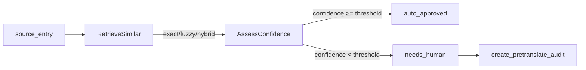

# Agent 测试与 Trace 可视化

← [[README]] · [项目根 README](../README.md) | [[references/本地开发]] · [本地开发](本地开发.md) | [[terminology-agent/README]] · [Agent README](../terminology-agent/README.md)

本文档是 **terminology-agent** 测试与 Agent 轨迹可视化的单一事实来源（SSOT）。默认 **无需 MySQL、无需 LLM Key** 即可跑完全部 15 个用例。

---

## 1. 概述

测试采用 **共置 `tests/`** 目录：与源码同层，改 `pre_translate_service.py` 时可直接打开旁边测试做 TDD 红绿。

```
terminology-agent/app/
├── conftest.py                    # 全局 fixtures
├── testing/fixtures/              # 样例 JSON
├── services/tests/                # 纯函数 + PreTranslateService
├── api/tests/                     # FastAPI 路由
├── graph/tests/                   # LangGraph 条件路由
└── schemas/tests/                 # Pydantic 契约
```

环境准备见 [[references/本地开发]] §0；安装开发依赖：

```powershell
cd terminology-agent
pip install -e ".[dev]"
```

---

## 2. 目录与 Fixtures

### 2.1 共享 Fixtures（`app/conftest.py`）

| Fixture | 用途 |
|---------|------|
| `sample_entry_oid` | 含 `%1/%2` 占位符的 OID 样例词条 |
| `sample_entries` | 从 `app/testing/fixtures/entries.json` 加载 |
| `mock_translate_entry` | 模拟 `t_translate` 精确匹配行 |
| `mock_fuzzy_entries` | 模拟模糊匹配候选 |
| `mock_repo` | AsyncMock TermRepository |
| `pre_translate_service` | 注入 mock repo 的 PreTranslateService |
| `api_client` | httpx AsyncClient + dependency_overrides |
| `sample_audit_record` | 模拟 pending audit ORM 对象 |

### 2.2 样例数据

| 文件 | 内容 |
|------|------|
| `app/testing/fixtures/entries.json` | 含 OID、parentID、空 entry 边界 |
| `app/testing/fixtures/translate_rows.json` | 精确匹配术语库行 |

---

## 3. 测试用例清单（15）

### 3.1 `@pytest.mark.unit` — 纯函数（3）

| 用例 | 文件 | 验证什么 | 关联源码 | 单独运行 |
|------|------|----------|----------|----------|
| `test_strip_placeholders_removes_percent_n` | `app/services/tests/test_helpers.py` | `%1/%2` 占位符剥离后再比相似度 | `_strip_placeholders` | `pytest app/services/tests/test_helpers.py::test_strip_placeholders_removes_percent_n -v` |
| `test_similarity_identical_is_one` | 同上 | 相同串 → 相似度 1.0 | `_similarity` | `pytest app/services/tests/test_helpers.py::test_similarity_identical_is_one -v` |
| `test_parse_target_lang_splits_on_dash` | 同上 | `中文-俄文` → `俄文` | `_parse_target_lang` | `pytest app/services/tests/test_helpers.py::test_parse_target_lang_splits_on_dash -v` |

### 3.2 `@pytest.mark.service` — Service 层 Mock Repo（5）

| 用例 | 文件 | 验证什么 | 关联源码 | 单独运行 |
|------|------|----------|----------|----------|
| `test_exact_match_auto_approved` | `app/services/tests/test_pre_translate_service.py` | 精确匹配 → `auto_approved`、回填译文、不写 audit | `PreTranslateService.batch_pre_translate` | `pytest app/services/tests/test_pre_translate_service.py::test_exact_match_auto_approved -v` |
| `test_fuzzy_match_respects_threshold` | 同上 | 低相似度 → `needs_human` + `create_pretranslate_audit` | `_retrieve_similar` 模糊分支 | `pytest app/services/tests/test_pre_translate_service.py::test_fuzzy_match_respects_threshold -v` |
| `test_no_match_low_confidence_pending` | 同上 | 无命中 → confidence=0.45、`hybrid` | `_retrieve_similar` 兜底 | `pytest app/services/tests/test_pre_translate_service.py::test_no_match_low_confidence_pending -v` |
| `test_skips_child_entries` | 同上 | 含 `parentID` 的子词条跳过 | `batch_pre_translate` 循环 | `pytest app/services/tests/test_pre_translate_service.py::test_skips_child_entries -v` |
| `test_agent_meta_shape` | 同上 | `agent_meta` 六字段契约 + `similar_terms` 结构 | `agent_meta` 构造 | `pytest app/services/tests/test_pre_translate_service.py::test_agent_meta_shape -v` |

### 3.3 `@pytest.mark.api` — FastAPI 端点（3）

| 用例 | 文件 | 验证什么 | 关联源码 | 单独运行 |
|------|------|----------|----------|----------|
| `test_health` | `app/api/tests/test_router.py` | `GET /agent/health` 返回 `{ code, data.status }` | `router.health` | `pytest app/api/tests/test_router.py::test_health -v` |
| `test_batch_pretranslate_response_shape` | 同上 | `POST /agent/pre-translate/batch` 响应含 `list/auto_count/pending_count` | `router.batch_pre_translate` | `pytest app/api/tests/test_router.py::test_batch_pretranslate_response_shape -v` |
| `test_review_approved_merge_to_store` | 同上 | `approved` 审核 → `insert_translate` 写入术语库 | `router.review_term` | `pytest app/api/tests/test_router.py::test_review_approved_merge_to_store -v` |

### 3.4 `@pytest.mark.graph` — LangGraph 路由（2）

| 用例 | 文件 | 验证什么 | 关联源码 | 单独运行 |
|------|------|----------|----------|----------|
| `test_route_after_discover_new_term` | `app/graph/tests/test_term_learning_graph.py` | 新术语 → 路由到 `analyze_context` | `_route_after_discover` | `pytest app/graph/tests/test_term_learning_graph.py::test_route_after_discover_new_term -v` |
| `test_route_after_discover_existing` | 同上 | 已有术语 → 路由到 `END` | `_route_after_discover` | `pytest app/graph/tests/test_term_learning_graph.py::test_route_after_discover_existing -v` |

### 3.5 Schemas — Pydantic 契约（2，无 marker）

| 用例 | 文件 | 验证什么 | 关联源码 | 单独运行 |
|------|------|----------|----------|----------|
| `test_audit_record_coerce_is_new_term` | `app/schemas/tests/test_agent_schemas.py` | MySQL TINYINT(1) → `bool` | `AuditRecordData._coerce_is_new_term` | `pytest app/schemas/tests/test_agent_schemas.py::test_audit_record_coerce_is_new_term -v` |
| `test_pretranslate_batch_data_list_alias` | 同上 | 字段 `entry_list` / JSON 别名 `list` | `PreTranslateBatchData` | `pytest app/schemas/tests/test_agent_schemas.py::test_pretranslate_batch_data_list_alias -v` |

---

## 4. 批量运行命令

在 `terminology-agent/` 目录下执行：

```powershell
# 全量（15 用例）
pytest -v

# 按模块（改 service 时最常用）
pytest app/services/tests -v
pytest app/api/tests -v
pytest app/graph/tests -v
pytest app/schemas/tests -v

# 按 marker
pytest -m unit -v
pytest -m service -v
pytest -m api -v
pytest -m graph -v

# 关键字过滤
pytest -k "exact_match" -v
pytest -k "route_after_discover" -v
```

---

## 5. TDD 红绿工作流

1. 改 `app/services/pre_translate_service.py`（或对应模块源码）
2. **RED**：在同目录 `tests/test_*.py` 写失败断言
3. **GREEN**：改实现直到 `pytest app/services/tests -v` 全绿
4. **REFACTOR**：提取纯函数 / dataclass，测试仍绿
5. Cursor 侧边栏展开 `services/` 可同时看到源码与 tests

后续 PreTranslate 迁 LangGraph 时：在 `app/graph/tests/` 新增 graph 测试，**`app/services/tests/` 行为契约测试保持不变**。

---

## 6. Agent 轨迹可视化

除 pytest 外，还有多种方式直观观察 Agent 行为与路由决策。

### 6.1 方式对比

| 方式 | 适用场景 | 操作 |
|------|----------|------|
| **Cursor Testing 面板** | 浏览 / 点跑 15 个用例 | 侧边栏 Testing → 展开 `app/**/tests` → 点击运行 |
| **`trace_agent_demo.py`** | LangGraph 静态图 + PreTranslate 逐步 trace | 见 §6.2 |
| **FastAPI Swagger** | 在线调 API、观察 JSON 响应 | 启动 Agent 后访问 http://localhost:18002/docs |
| **术语学习前端** | 业务结果（待审核列表、置信度） | [[references/本地开发]] → http://localhost:18000 |

### 6.2 Trace Demo（`devtools/trace_agent_demo.py`）

此文件**不在 `tests/` 内**，pytest 不收集。文件顶部 markdown cell 含**新手导读**（两条 Agent 链路、如何读 `print` 输出）；每个代码 cell 前有 docstring 说明该步目的。

导出 HTML 示例：[`docs/agents/trace_agent_demo.html`](../docs/agents/trace_agent_demo.html)

在 VS Code / Cursor 中打开后逐 `# %%` cell 运行（Interactive / Run Cell）：

| Cell | 内容 | 输出 |
|------|------|------|
| **0** | 路径引导（`sys.path` 加入 `terminology-agent` 根目录） | 无输出；**必须先跑**，否则可能报 `No module named 'config.settings'` |
| 1 | LangGraph 静态图 | Mermaid PNG（discover → analyze_context → llm_suggest → …） |
| 2a | 精确匹配 PreTranslate trace | 打印 `RetrieveSimilar` → `AssessConfidence` 步骤 |
| 2b | 无命中 trace（纯函数） | 打印 confidence=0.45、`route=needs_human` |
| 3 | astream_events 占位 | 事件流格式化（后续可 mock LLM 扩展） |

```powershell
cd terminology-agent
pip install -e ".[dev]"   # 含 ipython、pillow
# 在编辑器中打开 devtools/trace_agent_demo.py
# 从 cell 0 开始逐格运行（不要跳过 cell 0）
```

**常见报错**

| 报错 | 处理 |
|------|------|
| `No module named 'config.settings'` | 先运行 **cell 0**（路径引导） |
| `asyncio.run() cannot be called from a running event loop` | cell 2a 使用 **`await`**，不要用 `asyncio.run()`（Interactive 已自带事件循环） |

### 6.3 Trace 工具 API（`app/graph/trace_utils.py`）

测试与 Demo 共用，保证「测试绿 = trace 可复现」：

| 函数 | 作用 |
|------|------|
| `render_graph_png(compiled_graph)` | 导出 LangGraph Mermaid PNG 字节流 |
| `build_pretranslate_trace_steps(retrieval, threshold)` | 根据检索结果构建 trace 步骤列表 |
| `collect_pretranslate_trace(service, ...)` | 对单条词条执行 `_retrieve_similar` 并返回 trace |
| `format_astream_events(events)` | 将 LangGraph `astream_events` 格式化为可读文本 |

### 6.4 PreTranslate Trace 流程



每步 trace 字典示例：

```python
# RetrieveSimilar 阶段
{"stage": "RetrieveSimilar", "retrieval_method": "exact", "confidence": 1.0, ...}

# AssessConfidence 阶段
{"stage": "AssessConfidence", "threshold": 0.8, "confidence": 1.0, "route": "auto_approved"}
```

---

## 7. 相关文档

| 文档 | 说明 |
|------|------|
| [[references/README]] | References 总索引 |
| [[references/本地开发]] | Agent 本地开发、场景 A/B |
| [[terminology-agent/README]] | Agent 模块 README |
| [[README]] | 项目根 README |

← [[README]] · [项目根 README](../README.md)
