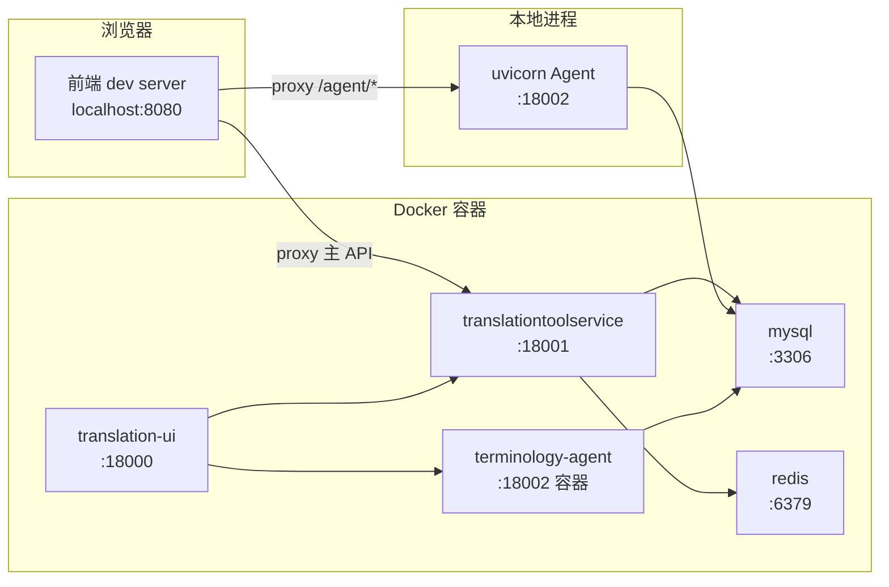

# 本地开发指南（Agent 优先）

本项目的增量开发以 **`terminology-agent/`** 为主。Java 后端 [`translationtoolservice/`](../translationtoolservice) 一般只通过 Docker 运行；MySQL / Redis 也一律放 Docker，不必本机安装。

---

## 0. 快速开始（Agent 开发者读这一节）

```powershell
# 1. 项目根目录：起 Docker 依赖（不含 Agent 容器，避免占 18002）
cd F:\Documents\Repertory\Sieyuan\translationtool
docker compose up -d mysql redis translationtoolservice translation-ui
docker stop terminology-agent

# 2. 本地起 Agent（改代码后 --reload 自动生效）
cd terminology-agent
copy .env.example .env   # 首次：填入 LLM_API_KEY
pip install -e ".[dev]"
uvicorn app.main:app --host 0.0.0.0 --port 18002 --reload

# 3. 验证
#    http://localhost:18002/docs
#    http://localhost:18002/agent/health
```

**要看术语学习 UI 并联调本地 Agent** → 用 [场景 B](#4-场景-bagent--前端本地--其余-docker)，访问 http://localhost:8080。

**关于 18000**：Docker 前端（nginx）把 `/agent/` 代理到**容器内** `terminology-agent:18002`，不是宿主机。Agent 本地跑时，18000 上的术语学习页**默认调不到**本地 Agent。

| 访问方式 | Agent 本地时 |
|----------|--------------|
| `localhost:18002/docs`、curl/Postman | 可用 |
| `localhost:18000` 术语学习页 | 默认不可用 |
| `localhost:8080` + `pnpm run serve` | 可用（dev proxy → 18002） |

18000 适合 Agent 已打进 Docker 后的整体验收；日常 Agent 开发用 18002/docs 或场景 B。

---

## 1. 架构与端口



| 服务 | 目录 | 容器名 | 宿主机端口 | Agent 开发者关注度 |
|------|------|--------|------------|-------------------|
| 术语 Agent | `terminology-agent/` | `terminology-agent` | **18002** | **主改这里** |
| MySQL | `db/` | `translation-mysql` | **3306** | 需要（Agent 读写库） |
| 后端 | `translationtoolservice/` | `translationtoolservice` | **18001** | Docker 跑着即可 |
| Redis | — | `translation-redis` | **6379** | 不用管（仅 Java 用） |
| 前端（Docker） | `translation/` | `translation-ui` | **18000** | 场景 A 看其他页面 |
| 前端（开发） | `translation/` | — | **8080** | 场景 B 联调 UI |

**登录（Docker 默认兜底账户）**

| 账户 | 密码 |
|------|------|
| `admin` | `admin123` |

---

## 2. MySQL / Redis：放 Docker 就够

**结论：对日常开发几乎没区别，一律放 Docker，不必本机安装。**

| 维度 | Docker 跑 MySQL/Redis | 本机安装 |
|------|----------------------|----------|
| 连接方式 | 宿主机 `127.0.0.1:3306` / `6379` | 同样 |
| Agent `.env` | `MYSQL_HOST=127.0.0.1`（默认值） | 相同 |
| 数据持久化 | `docker volume mysql-data` | 本机数据目录 |
| 初始化 | 首次起容器自动跑 `db/init/` | 需手动建库导入 |

### 与 Agent 的关系

- **MySQL**：Agent **需要**。读写库 **`translationtool`**（审核表、术语表等）。`.env` 里 `MYSQL_HOST=127.0.0.1` 即连 Docker 映射出来的端口。
- **Redis**：Agent **不需要**（代码中无 redis 引用）。仅 Java 后端使用；起 `translationtoolservice` 时 docker compose 会顺带起 redis，Agent 开发者无需配置。

### Agent 场景最小 Docker 集合

| 目的 | 起的容器 |
|------|----------|
| 只测 Agent API / OpenAPI | `mysql`（+ `docker stop terminology-agent`） |
| 登录 + 看现有页面（非术语学习 Agent 联调） | `mysql` + `redis` + `translationtoolservice` + `translation-ui` |
| 术语学习 UI + 本地 Agent | `mysql` + `redis` + `translationtoolservice`（见场景 B） |

---

## 3. 场景 A：Agent 本地 + 其余 Docker（主场景）

改 LangGraph、LLM 提示词、API 逻辑，用 OpenAPI / curl 验证，**不改前端**。

### Docker

```powershell
docker compose up -d mysql redis translationtoolservice translation-ui
docker stop terminology-agent
```

### 本地 Agent

```powershell
cd terminology-agent
uvicorn app.main:app --host 0.0.0.0 --port 18002 --reload
```

### 验证

- OpenAPI：http://localhost:18002/docs
- 健康检查：http://localhost:18002/agent/health
- 其他业务页（工作台等）：http://localhost:18000（走 Docker 前端 + 后端，与 Agent 无关）

### 不适合

术语学习 Vue 页面联调本地 Agent（nginx 仍指向容器 Agent）→ 用 [场景 B](#4-场景-bagent--前端本地--其余-docker)。

---

## 4. 场景 B：Agent + 前端本地 + 其余 Docker

在 [`terminologyAgent/index.vue`](../translation/src/views/terminologyAgent/index.vue) 加 UI、对接新 Agent 接口。

### Docker

```powershell
docker compose up -d mysql redis translationtoolservice
docker stop terminology-agent
# 不启 translation-ui，避免 18000 与 8080 混淆
```

### 本地

```powershell
# 终端 1：Agent
cd terminology-agent
uvicorn app.main:app --host 0.0.0.0 --port 18002 --reload

# 终端 2：前端
cd translation
pnpm install
pnpm run serve
```

访问 **http://localhost:8080**，登录后进「术语学习」。`/agent/*` 经 [`vue.config.js`](../translation/vue.config.js) dev proxy 转发到本地 **18002**。

| 前端请求 | 代理目标 |
|----------|----------|
| `/userLogin`、`/workbench` 等 | `http://localhost:18001` |
| `/agent/*` | `http://localhost:18002` |

保持 [`public/config/index.js`](../translation/public/config/index.js) 中 **`serverURL: ''`**，不要改成 `18001`。

---

## 5. Agent 开发细节

### 5.1 环境准备

| 组件 | 版本 | 必需 |
|------|------|------|
| Python | **3.11+** | Agent 必选 |
| Docker + Compose | 最新稳定版 | 必选（MySQL + 后端） |
| Node.js | 16.x | 场景 B 前端联调时 |
| JDK / Maven | 11 / 3.9+ | 仅附录 Java 本地开发 |

### 5.2 配置 `.env`

```powershell
cd terminology-agent
copy .env.example .env
```

```env
AGENT_HOST=0.0.0.0
AGENT_PORT=18002

MYSQL_HOST=127.0.0.1
MYSQL_PORT=3306
MYSQL_USER=root
MYSQL_PASSWORD=123456
MYSQL_DATABASE=translationtool

LLM_API_KEY=你的密钥
LLM_BASE_URL=https://api.deepseek.com
LLM_MODEL=deepseek-chat
```

### 5.3 安装与启动

```powershell
pip install -e ".[dev]"
uvicorn app.main:app --host 0.0.0.0 --port 18002 --reload
```

### 5.4 端口冲突

本地 Agent 与 Docker Agent 不能同时占 **18002**：

```powershell
docker stop terminology-agent
```

### 5.5 主要改代码位置

| 路径 | 作用 |
|------|------|
| `app/graph/` | LangGraph 工作流与节点 |
| `app/api/router.py` | HTTP 接口 |
| `app/repository/` | 数据库访问 |
| `app/schemas/` | 请求/响应模型 |
| `config/settings.py` | 环境变量 |

### 5.6 与前端约定

[`translation/src/http/api/terminologyAgent.js`](../translation/src/http/api/terminologyAgent.js) 请求 `/agent/*`。响应须符合 Java 风格包装（`router.py` 中 `_ok()` → `{ code, message, data }`），否则前端 axios 拦截器可能报错。

### 5.7 重建 Agent Docker 镜像（验收 / 部署）

```powershell
docker compose build terminology-agent
docker compose up -d terminology-agent
# 整体验收：http://localhost:18000
```

---

## 6. 前端页面改动要点（非主路径）

仅在做术语学习 UI 或新菜单页时需要：

1. **菜单**：`db/opt/` 增量 SQL → 库 **`translationtool`**（不是 `SymbolMaker`）
2. **路由**：[`asyncRouter.js`](../translation/src/router/asyncRouter.js) 动态加载 `views/` 下组件
3. **API 模块**：`src/http/api/` 下新增，路径走 `/agent/*`
4. **侧边栏图标**：DB `icon` 须与 [`layout.vue`](../translation/src/views/layout/layout.vue) 的 `menuIcon` 键一致（如 `Config`，不是 `configIcon`）
5. 改菜单后 **重新登录**（菜单缓存在 sessionStorage）

---

## 7. 数据库与菜单

### 7.1 库名

词条翻译工具使用 **`translationtool`**。Navicat 连远程时勿改错库（如 `SymbolMaker`）。

Docker 本地连接：

| 项 | 值 |
|----|-----|
| Host | `127.0.0.1` |
| Port | `3306` |
| User / Password | `root` / `123456` |
| Database | **`translationtool`** |

### 7.2 增量脚本

`db/init/` 仅在 MySQL **首次**建 volume 时执行。已有 volume 需手动跑增量，例如术语学习菜单：

```powershell
Get-Content db\opt\add-menu-terminology-agent.sql | docker exec -i translation-mysql mysql -uroot -p123456 translationtool
```

查菜单（PowerShell 避免中文编码问题）：

```powershell
docker exec translation-mysql mysql -uroot -p123456 -D translationtool -e "SELECT id, menu_name, icon, active_icon, name FROM t_menu WHERE id='16';"
```

### 7.3 菜单图标

| 菜单 | icon | active_icon |
|------|------|-------------|
| 工作台 | `Work` | `WorkActive` |
| 词条管理 / 术语库 | `Entry` | `EntryActive` |
| 配置管理 / 翻译校验 / 术语学习 | `Config` | `ConfigActive` |
| 文件管理 | `FileManage` | `FileManageActive` |

---

## 8. 附录：Java 本地开发（一般不需要）

**仅当必须改 Java 接口、又不愿重建 Docker 镜像时**使用。

### 8.1 只起 MySQL + Redis

```powershell
docker compose up -d mysql redis
docker stop translationtoolservice
```

### 8.2 环境变量覆盖后本地启动

`application-docker.yml` 中主机名 `mysql`/`redis` 仅在容器网内有效，本地要用 `127.0.0.1`：

```powershell
cd translationtoolservice

$env:SPRING_PROFILES_ACTIVE="docker"
$env:SPRING_DATASOURCE_URL="jdbc:mysql://127.0.0.1:3306/translationtool?useUnicode=true&characterEncoding=UTF-8&useJDBCCompliantTimezoneShift=true&useLegacyDatetimeCode=false&serverTimezone=Asia/Shanghai&allowMultiQueries=true&socketTimeout=60000&connectTimeout=5000&autoReconnect=true"
$env:SPRING_DATASOURCE_USERNAME="root"
$env:SPRING_DATASOURCE_PASSWORD="123456"
$env:SPRING_REDIS_HOST="127.0.0.1"
$env:SPRING_REDIS_PORT="6379"
$env:SPRING_REDIS_PASSWORD="210093"

mvn spring-boot:run -DskipTests
```

主类：`com.shr.translationtoolservice.TranslationtoolserviceApplication`，端口 **18001**。

### 8.3 编译 JAR 并重建 Docker 镜像

```powershell
cd translationtoolservice && mvn package -DskipTests && cd ..
docker compose build translationtoolservice
docker compose up -d translationtoolservice
```

---

## 9. 常见问题

### Q: Agent 本地跑，18000 术语学习页接口失败？

18000 的 nginx 代理到**容器** Agent，不是宿主机。改用 **8080（场景 B）** 或直连 **18002/docs**。

### Q: 启动 uvicorn 报 18002 端口占用？

```powershell
docker stop terminology-agent
```

### Q: 改了 Navicat 菜单，前端没变化？

1. 确认库是 **`translationtool`**，不是 `SymbolMaker`
2. Docker 后端连的是**容器 MySQL**，不是远程 196.125（除非改了后端配置）
3. 重新登录清 menu 缓存

### Q: 术语学习有文字无图标？

`t_menu` 的 `icon` / `active_icon` 须为 `Config` / `ConfigActive`（不能 NULL 或 `configIcon`）。

### Q: 8080 登录失败 / 404？

1. `docker compose ps` 确认 `translationtoolservice` 在跑
2. `serverURL` 保持 `''`
3. 确认 `vue.config.js` proxy 指向 `18001` / `18002`

### Q: `docker exec ... WHERE menu_name='术语学习'` 查不到？

PowerShell 中文乱码，改用 `WHERE id='16'` 或 `WHERE name='terminologyAgent'`。

### Q: 18000 和 8080 区别？

| 地址 | 用途 |
|------|------|
| http://localhost:18000 | Docker 打包前端 + nginx |
| http://localhost:8080 | 本地 dev server，改 UI 即时生效 |

---

## 10. 文件索引与命令备忘

### 相关文件

| 文件 | 作用 |
|------|------|
| `docker-compose.yml` | 服务编排 |
| `terminology-agent/.env.example` | Agent 环境变量 |
| `terminology-agent/app/api/router.py` | Agent HTTP 接口 |
| `translation/vue.config.js` | 前端 dev 代理 |
| `translation/public/config/index.js` | `serverURL` |
| `translation/nginx.conf` | 生产 nginx（18000） |
| `translation/src/http/api/terminologyAgent.js` | 前端 Agent API |
| `db/opt/add-menu-terminology-agent.sql` | 术语学习菜单 |

### 一键命令

```powershell
# 场景 A：Agent 本地 + 其余 Docker（最常用）
docker compose up -d mysql redis translationtoolservice translation-ui
docker stop terminology-agent
cd terminology-agent && uvicorn app.main:app --host 0.0.0.0 --port 18002 --reload

# 场景 B：Agent + 前端本地 + 其余 Docker
docker compose up -d mysql redis translationtoolservice
docker stop terminology-agent
# 终端1: uvicorn（同上）
# 终端2: cd translation && pnpm run serve  →  http://localhost:8080

# 全 Docker 验收（Agent 也在容器里）
docker compose up -d
#  →  http://localhost:18000

# 停掉全部
docker compose down

# 停掉并清数据库（慎用，会重建 volume）
docker compose down -v
```
