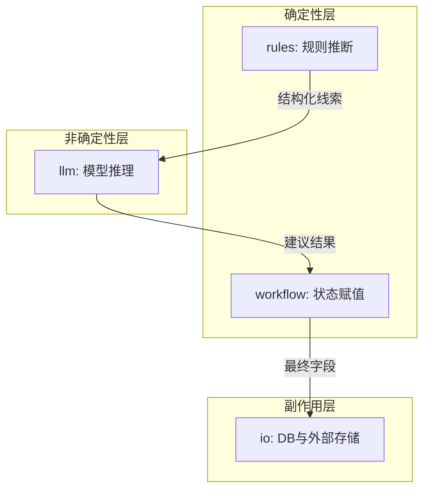
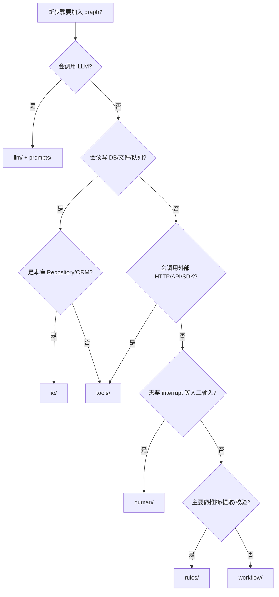

# Graph 节点目录规范

本目录存放 **LangGraph 节点函数**（`async def *_node(state, config?) -> TermState`）。  
新增节点时，先按下方决策树选定子目录，再注册到 `graph.py`。

## 本目录职责与边界

| 放这里 | 不放这里 |
|--------|----------|
| 在图中注册为 `add_node` 的一步计算 | 条件路由函数 → [`../routes.py`](../routes.py) |
| 读 state → 计算/副作用 → 写 state | System prompt、Jinja 模板 → [`../prompts/`](../prompts/) |
| | 连边、入口、编译 → [`../graph.py`](../graph.py) |
| | 跨节点共享工具 → [`../trace_utils.py`](../trace_utils.py) 或未来 `helpers/` |
| | 仅服务单节点的 `_infer_*` 私有函数 → 留在节点文件内 |

**两个审查维度**

- **业务流水线**（discover → analyze → suggest → …）→ 看 [`../graph.py`](../graph.py)
- **实现风格**（LLM / 规则 / I/O / …）→ 看本目录子文件夹

---

## 分类总览

| 子目录 | 中文名 | 状态 | 本仓库节点 |
|--------|--------|------|------------|
| [`rules/`](rules/) | 规则 / 纯函数节点 | 已用 | `analyze_context_node` |
| [`llm/`](llm/) | 大模型推理节点 | 已用 | `llm_suggest_node` |
| [`io/`](io/) | 持久化 / 副作用 I/O | 已用 | `discover_node`, `update_termstore_node` |
| [`workflow/`](workflow/) | 工作流状态节点 | 已用 | `review_node` |
| [`tools/`](tools/) | 工具调用节点 | 预留 | — |
| [`human/`](human/) | 人工参与节点 | 预留 | — |

设计依据：[LangGraph Graph API](https://docs.langchain.com/oss/python/langgraph/graph-api)、[Workflows and agents](https://docs.langchain.com/oss/python/langgraph/workflows-agents)，以及生产实践（[能确定性就不上 LLM](https://blog.n8n.io/production-ai-playbook-complex-agent-patterns/)、[Workflows vs Agents](https://towardsdatascience.com/a-developers-guide-to-building-scalable-ai-workflows-vs-agents/)）。

---

## 各类详细说明

### `rules/` — 规则 / 纯函数节点

**定义**：无外部 I/O、无 LLM；从 state 读取字段，用确定性逻辑（正则、映射表、算术、校验）产出 state 更新。

**判断特征**

- 同样输入永远同样输出
- 可纯单元测试，无需 mock DB / HTTP / LLM
- 典型代码：`re.findall`、`dict` 查找、`if/elif` 枚举分类

**典型依赖**：仅 `TermState`、标准库

**测试要点**：覆盖空输入、边界格式；测私有纯函数时可单独 import

**本仓库示例**：[`rules/analyze_context.py`](rules/analyze_context.py) — 从 context 推断 `ui_button` 等类型、提取关键词

**反例（应放到别的目录）**

- 调 `ChatOpenAI` → `llm/`
- 调 `TermRepository` → `io/`
- 只设 `review_status = "pending"` 而无推断逻辑 → `workflow/`

---

### `llm/` — 大模型推理节点

**定义**：调用 LLM 做语义判断、生成、分类、改写；非确定性，有 token 成本与延迟。

**判断特征**

- 出现 `ChatOpenAI`、`ainvoke`、structured output、embedding
- Prompt 正文放在 [`../prompts/`](../prompts/)，节点只负责组装消息与解析响应

**典型依赖**：`config.settings`、`langchain_openai`、[`../prompts/`](../prompts/)

**测试要点**：mock `ChatOpenAI`；settings 缺失时走降级路径；prompt 变更测 `prompts/` 单测

**本仓库示例**：[`llm/suggest.py`](llm/suggest.py) + [`../prompts/suggest.py`](../prompts/suggest.py)

**反例**

- 用关键词表做 UI 类型分类（可枚举、无歧义）→ `rules/`
- 把 prompt 大段字符串写在节点文件里 → 应抽到 `prompts/`

---

### `io/` — 持久化 / 副作用 I/O 节点

**定义**：读写**本服务拥有的**外部系统：本库 DB、本地文件、消息队列、缓存等。职责是把 state 落库或从库加载。

**判断特征**

- 使用 `RunnableConfig` 注入 `session` / `audit_id`
- 调用 `Repository`、ORM、`open()`、Redis 客户端等

**典型依赖**：`TermRepository`、`AsyncSession`

**测试要点**：mock Repository / session；验证写入字段映射完整

**本仓库示例**

- [`io/discover.py`](io/discover.py) — 查术语库是否已有词条
- [`io/update_termstore.py`](io/update_termstore.py) — 写回 `term_agent_audit`

**反例**

- 调第三方 HTTP 术语 API → `tools/`（不是本库 Repository）
- 只改 state 不落库 → `workflow/`

**与 `tools/` 口诀**：数据在本项目 DB / 已有 Repository → `io/`；数据在别的服务、走 HTTP/SDK/Tool 协议 → `tools/`。

---

### `workflow/` — 工作流状态节点

**定义**：只改 state 字段、不调外部世界；表达业务状态机、聚合字段、设置 `next_node` 路由提示。

**判断特征**

- 无 DB、无 HTTP、无 LLM
- 若干 `if/else` 给 `review_status`、`error` 等赋值

**典型依赖**：仅 `TermState`

**测试要点**：状态机分支（pending / rejected / error）；验证 `next_node` 与边定义一致

**本仓库示例**：[`workflow/review.py`](workflow/review.py) — LLM 失败后标 `rejected`，否则 `pending`

**反例**

- 从 context 用正则提取关键词 → `rules/`（在做推断，不是纯状态流转）
- 真正 `interrupt()` 等人审输入 → `human/`（见下）

---

### `tools/` — 工具调用节点（预留）

**定义**：通过 Tool / HTTP / MCP 调用**外部**系统；LangGraph 中常用 `ToolNode` 或薄封装节点。

**何时启用**：需查第三方术语 API、向量检索、网页搜索、调用外部翻译服务等。

**示例（术语场景，尚未实现）**

- `lookup_tm_term` — 调 TM 记忆库
- `search_glossary_api` — 调企业术语平台 HTTP API

**测试要点**：mock HTTP；超时与重试；单测不携带真实 API key

**目录状态**：当前为空（见 `.gitkeep`），有真实节点时再删占位文件。

---

### `human/` — 人工参与节点（预留）

**定义**：Human-in-the-Loop — `interrupt()` 暂停图执行，等待 API 回调或审核界面；配合 checkpoint 挂起。

**何时启用**：敏感写库前审批、低置信度强制人工、合规留痕。

**示例（尚未实现）**

- `await_human_review_node` — 配合 `interrupt_before` 在写库前暂停

**测试要点**：interrupt 前后 state；`Command(resume=...)` payload

**目录状态**：当前为空（见 `.gitkeep`）。

---

## 四类关系（当前 graph）

- **rules vs workflow**：都算确定性；`rules` 从原始输入**提取/推断**，`workflow` 根据已有结论**更新流程状态**
- **llm vs rules**：语义模糊、需创造性翻译 → `llm/`；关键词表、可枚举分类 → `rules/`
- **io vs tools**：本库 Repository → `io/`；外部服务 → `tools/`

---

## 新增节点决策树

---

## 新增节点 Checklist

1. 用决策树选定 `nodes/<kind>/`
2. 新建 `nodes/<kind>/<name>.py`，导出 `async def <name>_node(state, config?) -> TermState`
3. 在 [`__init__.py`](__init__.py) re-export
4. 在 [`../graph.py`](../graph.py) 中 `add_node` + 连边；分支逻辑写入 [`../routes.py`](../routes.py)
5. LLM 类：prompt 写入 [`../prompts/<name>.py`](../prompts/)
6. 在 [`../tests/`](../tests/) 补单测
7. 更新本 README 的「分类总览」表

**命名约定**

- 函数名：`<动作>_node`，如 `discover_node`
- 文件名：短动词或名词，如 `suggest.py`（不必重复 `_node` 后缀）
- 图中注册名：与业务阶段一致，如 `"llm_suggest"`（可与文件名不同）

---

## 参考链接

- [LangGraph Graph API](https://docs.langchain.com/oss/python/langgraph/graph-api) — 节点、边、state
- [Workflows and agents](https://docs.langchain.com/oss/python/langgraph/workflows-agents) — LLM / ToolNode / 编排分层
- [LangChain Application structure](https://docs.langchain.com/oss/python/langgraph/application-structure) — 官方目录建议
- [Production AI Playbook: Complex Agent Patterns](https://blog.n8n.io/production-ai-playbook-complex-agent-patterns/) — 确定性 vs LLM 分工
- [Workflows vs Agents](https://towardsdatascience.com/a-developers-guide-to-building-scalable-ai-workflows-vs-agents/) — 可测试性与可观测性
