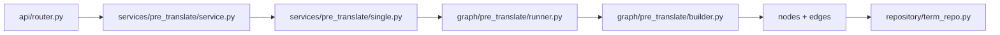
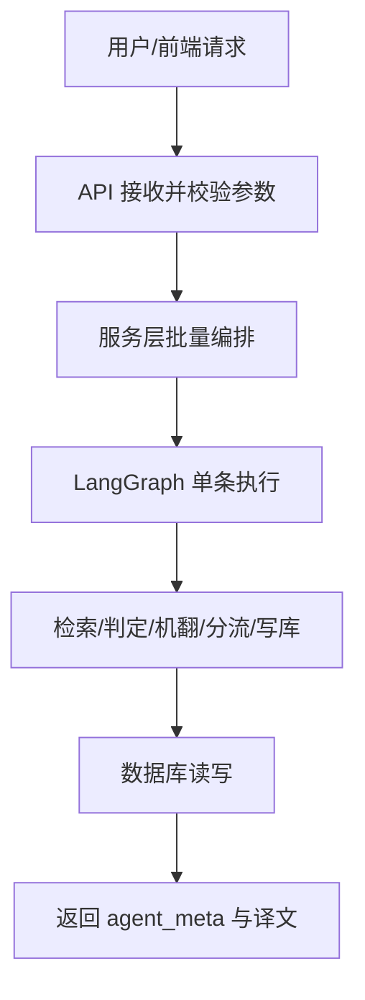
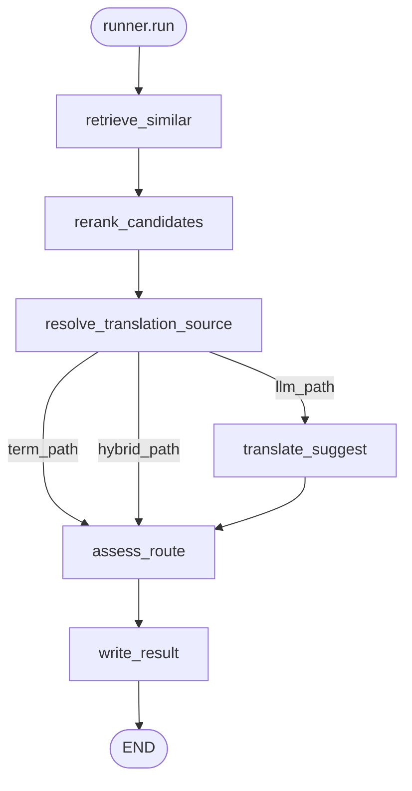
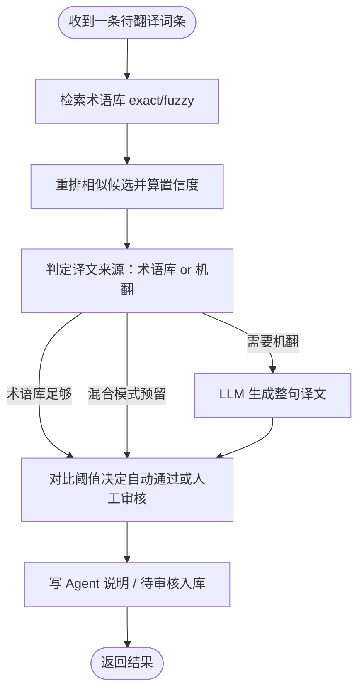
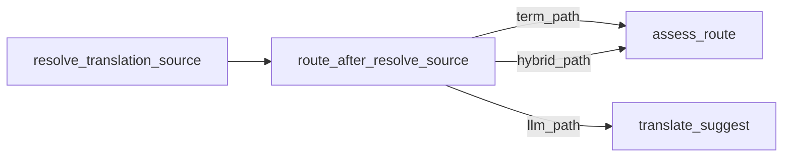
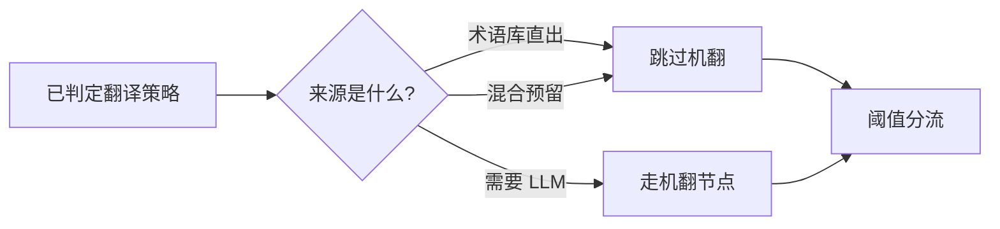
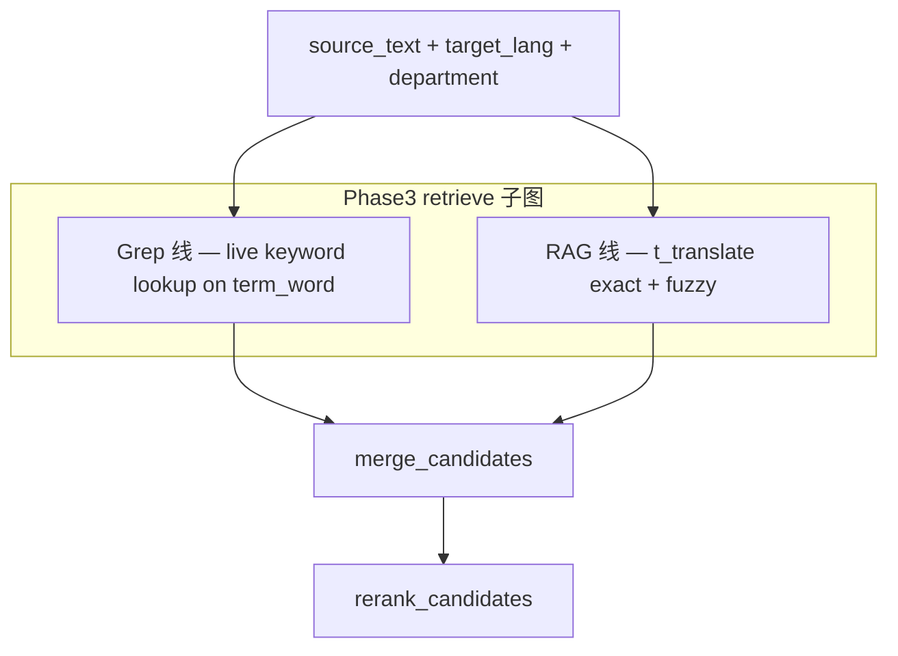

# PreTranslateGraph — 预翻译 LangGraph 工作域

← 图级索引：[`../README.md`](../README.md) · 节点规范：[`nodes/README.md`](nodes/README.md)

## 1. 这个 Agent 做什么

对**单条**工作台词条执行 RAG 预翻译：先在术语库做精确/模糊检索，再判定译文应来自术语库还是 LLM 机翻，最后按置信度阈值决定自动回填或写入待审核表。批量循环与 HTTP 不在本包，由 [`services/pre_translate/`](../../services/pre_translate/) 负责。

---

## 2. 在全项目中的位置

### 源码对照（调用链）



### 业务说明（人类阅读）



| 层 | 路径 | 职责 |
|----|------|------|
| API | `app/api/router.py` | HTTP 薄壳 |
| Services | `app/services/pre_translate/` | 批量过滤、循环、计数 |
| Graph | `app/graph/pre_translate/` | **本包** — 单条 LangGraph |
| Repository | `app/repository/term_repo.py` | 术语库 / audit 数据访问 |

---

## 3. 本包目录树

```
pre_translate/
├── README.md           # 本文件（域级 SSOT）
├── state.py            # PreTranslateState
├── constants.py        # FUZZY_AUTO_FLOOR 等
├── builder.py          # StateGraph 注册 + compile
├── runner.py           # PreTranslateGraph.run 入口
├── domain/             # TranslationSource 枚举、reasoning 格式化
├── edges/              # 条件边（只读 state）
├── nodes/              # intentions + features 节点
├── utils/              # retrieval / trace 纯函数
├── prompts/            # LLM 模板
└── tests/              # 图/节点/边单测
```

---

## 4. 主流程

### 源码对照（与 builder 一致）



### 业务说明（人类阅读）



---

## 5. 条件边

### 源码对照



实现：[`edges/after_resolve_source.py`](edges/after_resolve_source.py)

### 业务说明（人类阅读）



| `translation_source` | 路径键 | 下一节点 |
|----------------------|--------|----------|
| `term` | `term_path` | `assess_route` |
| `llm` | `llm_path` | `translate_suggest` → `assess_route` |
| `hybrid` | `hybrid_path` | `assess_route`（P1 stub，Phase 2 改连 decompose） |

---

## 6. State 字段

定义：[`state.py`](state.py)

| 分组 | 字段 | 说明 |
|------|------|------|
| 输入 | `source_text`, `target_lang`, `department`, `confidence_threshold` | 词条与任务上下文 |
| 输入 | `entry_info_id`, `task_id`, `task_name`, `product_name` | 工作台 / 任务元数据 |
| 检索 | `retrieval_method` | `exact` / `fuzzy` / `none` |
| 检索 | `retrieval_confidence`, `similar_terms`, `exact_hit`, `fuzzy_hit` | 检索结果 |
| 意图/译文 | `translation_source` | `term` / `llm` / `hybrid` |
| 意图/译文 | `suggested_translation`, `llm_detail`, `confidence` | 译文与置信度 |
| 输出 | `llm_reasoning`, `review_status`, `error`, `trace` | Agent 说明、分流、trace |

---

## 7. 节点一览

| 节点名 | 中文职责 | 文件 |
|--------|----------|------|
| `retrieve_similar` | 术语库 exact + fuzzy 检索 | [`nodes/features/io/retrieve_similar.py`](nodes/features/io/retrieve_similar.py) |
| `rerank_candidates` | 模糊候选重排与置信度 | [`nodes/features/rules/rerank_candidates.py`](nodes/features/rules/rerank_candidates.py) |
| `resolve_translation_source` | 判定 term / llm / hybrid | [`nodes/intentions/resolve_translation_source.py`](nodes/intentions/resolve_translation_source.py) |
| `translate_suggest` | LLM 整句机翻 | [`nodes/features/llm/translate_suggest.py`](nodes/features/llm/translate_suggest.py) |
| `assess_route` | 阈值分流 auto_approved / needs_human | [`nodes/features/workflow/assess_route.py`](nodes/features/workflow/assess_route.py) |
| `write_result` | 格式化 reasoning、写 audit | [`nodes/features/io/write_result.py`](nodes/features/io/write_result.py) |

---

## 8. Edges 一览

| 函数 | 触发节点 | 文件 |
|------|----------|------|
| `route_after_resolve_source` | `resolve_translation_source` 之后 | [`edges/after_resolve_source.py`](edges/after_resolve_source.py) |

---

## 9. Phase 2+ 扩展点

### Phase 3：Grep ∥ RAG 并行检索（设计，P2 未改主图）

Phase 2 已建 `term_word` 表与 Grep 线数据层；Phase 3 在 `retrieve_similar` 前/旁路并行：



| 线 | 语料 | 匹配方式 | 标记 |
|----|------|----------|------|
| **Grep** | `term_word` | Trie 拆词 + `WordRepository.find_by_word`；可选子串 LIKE | `retrieval_source: grep` |
| **RAG** | `t_translate` | exact / fuzzy（现有） | `retrieval_source: rag` |

Grep 线对标 Claude Code Grep：**确定性关键字查表**，无向量索引。消歧键 `(word, comment, target_lang)`；`department` 仅运行时过滤。

**代码位置**（refactor 后）：

| 组件 | 路径 |
|------|------|
| Trie 拆词 / extract | [`shared/term_word/`](../../shared/term_word/) |
| Grep 检索编排 | [`utils/grep_retrieve.py`](utils/grep_retrieve.py) |
| Trie 进程缓存 | [`repository/trie_cache.py`](../../repository/trie_cache.py) |
| DB lookup | [`repository/word_repo.py`](../../repository/word_repo.py) |
| 离线建库 ETL | [`shared/term_word/etl/`](../../shared/term_word/etl/) |
| 建库 CLI | [`scripts/build_word_index.py`](../../../scripts/build_word_index.py) |
| 域 SSOT | [`shared/term_word/README.md`](../../shared/term_word/README.md) |

- `TranslationSource.HYBRID` → `nodes/features/llm/decompose_compose.py`（未建）
- `retrieval_method=decomposed` 子图插入 `exact` 未命中后
- `analyze_context_node` 已存在于 `nodes/features/rules/`，主图 P1 未接入

---

## 10. 维护 Checklist

改 [`builder.py`](builder.py) 连边或新增节点时：

1. 同步更新本节 **双轨 Mermaid**（源码 + 业务）
2. 更新 [`nodes/README.md`](nodes/README.md) 分类表（若新增节点类型）
3. 在 [`tests/`](tests/) 补单测；mock LLM 时 patch `builder.translate_suggest_node`
4. 更新 [`../../../references/agent-testing.md`](../../../references/agent-testing.md)（若影响测试路径）
