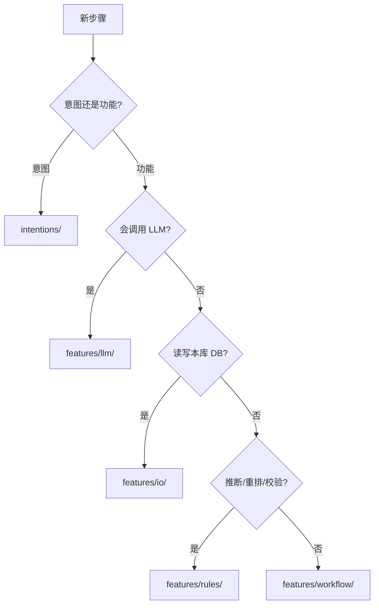

# Graph 节点目录规范

← **图级总览（双轨 Mermaid、State、调用链）**：[`../README.md`](../README.md)

本目录存放 **LangGraph 节点函数**（`async def *_node(state, config?) -> PreTranslateState`）。

## 顶层双轨结构

```
nodes/
├── intentions/     # 图意图层 — 「走哪条翻译策略」
└── features/       # 图功能层 — 「具体怎么做」
    ├── io/
    ├── rules/
    ├── llm/
    ├── workflow/
    ├── tools/      # 预留
    └── human/      # 预留
```

| 一级目录 | 职责 | 示例 |
|----------|------|------|
| [`intentions/`](intentions/) | 读 state → 写 `translation_source` / 路由策略 | `resolve_translation_source_node` |
| [`features/`](features/) | 检索、LLM、写库、阈值分流等 **执行** | `retrieve_similar_node`, `translate_suggest_node` |

**不放这里**：条件路由纯函数 → [`../edges/`](../edges/)；Prompt → [`../prompts/`](../prompts/)；编译图 → [`../builder.py`](../builder.py)；执行入口 → [`../runner.py`](../runner.py)。

---

## features/ 内分类

| 子目录 | 中文名 | P1 节点 |
|--------|--------|---------|
| [`features/io/`](features/io/) | DB / Repository I/O | `retrieve_similar`, `write_result` |
| [`features/rules/`](features/rules/) | 确定性纯函数 | `rerank_candidates`；`analyze_context`（Phase 3+ 复用） |
| [`features/llm/`](features/llm/) | LLM 推理 | `translate_suggest` |
| [`features/workflow/`](features/workflow/) | 状态机 / 分流 | `assess_route` |
| [`features/tools/`](features/tools/) | 外部 HTTP/API | —（预留） |
| [`features/human/`](features/human/) | HITL interrupt | —（预留） |

### 判断口诀

- 先问 **意图还是功能** → 策略判定进 `intentions/`，执行进 `features/<kind>/`
- 调 LLM → `features/llm/`
- 本库 Repository → `features/io/`
- 确定性重排 / 校验 → `features/rules/`
- 只改 `review_status` 等流程字段 → `features/workflow/`
- 外部服务 → `features/tools/`

---

## 新增节点决策树



---

## 新增节点 Checklist

1. 选定 `intentions/` 或 `features/<kind>/`
2. 新建 `*_node` 函数，更新对应 `__init__.py`
3. 在 [`../builder.py`](../builder.py) 注册 + [`../edges/`](../edges/) 连边
4. LLM 类：prompt 写入 [`../prompts/`](../prompts/)
5. 在 [`../tests/`](../tests/) 补单测
6. 更新 [`../README.md`](../README.md) 双轨 Mermaid + 本节分类表

**import 示例**

```python
from app.graph.pre_translate.nodes.features.io.retrieve_similar import retrieve_similar_node
from app.graph.pre_translate.nodes.intentions.resolve_translation_source import (
    resolve_translation_source_node,
)
```

---

## Phase 2 预留

- `TranslationSource.HYBRID` → `features/llm/decompose_compose.py`（未建）
- `retrieval_method=decomposed`
