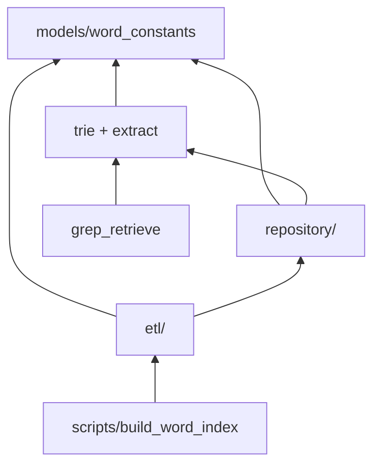

# term_word — Grep 线元词词典

← 项目根：[`../../../README.md`](../../../README.md) · PreTranslate Grep：[`../../graph/pre_translate/README.md`](../../graph/pre_translate/README.md) §9 · 建库 CLI：[`../../../scripts/build_word_index.py`](../../../scripts/build_word_index.py)

## 1. 这是什么

**term_word** 是 PreTranslate **Grep 线**的数据域：离线从 `t_translate` + `t_entry_info` 建库到 `term_word` 表，运行时通过 **jieba 切界**（[`segment.py`](segment.py)）+ 关键字查表提供确定性检索。

**所有可测试库代码都在 `app/shared/term_word/`**（≈ 前端 `src/`）。根目录 [`scripts/build_word_index.py`](../../../scripts/build_word_index.py) 仅为 CLI 薄壳。

---

## 2. 目录与职责

```
app/shared/term_word/
├── README.md
├── segment.py, extract.py   # 在线 jieba 切界 + 词提取
├── trie.py                  # 遗留 Trie（trie_cache/调试，非切界主路径）
├── tests/
└── etl/                      # 离线建库库代码
    ├── constants.py
    ├── conflict.py
    ├── join_entry_info.py
    ├── build.py              # async build_word_index()
    └── tests/

scripts/build_word_index.py   # CLI：python -m scripts.build_word_index
```

| 子包 | 消费者 | 说明 |
|------|--------|------|
| 根级 `segment` / `extract` | `grep_retrieve`、`decompose` | 在线 jieba 切界 SSOT |
| 根级 `trie` | `trie_cache`（可选） | 遗留最长匹配，非切界主路径 |
| `etl/` | `scripts/build_word_index` | join、矛盾检测、建库编排 |

**其他相关代码**：

| 层 | 路径 |
|----|------|
| ORM | `models/word.py`、`models/word_constants.py` |
| 仓储 | `repository/word_repo.py`、`repository/trie_cache.py` |
| 编排 | `graph/pre_translate/utils/grep_retrieve.py` |

---

## 3. 依赖方向



**禁止**：`repository/` import `graph/`。

---

## 4. 新增代码决策树

1. 仅 pre_translate 图内编排？ → `graph/pre_translate/utils/`
2. graph **与** repository 共用的在线纯算法？ → `shared/term_word/`（根级）
3. 离线建库纯函数 / 编排？ → `shared/term_word/etl/`
4. 建库 CLI 入口？ → `scripts/`（薄壳，import etl）
5. 含 AsyncSession / 缓存 / SQL？ → `repository/`
6. ORM 或 status 枚举？ → `models/`
